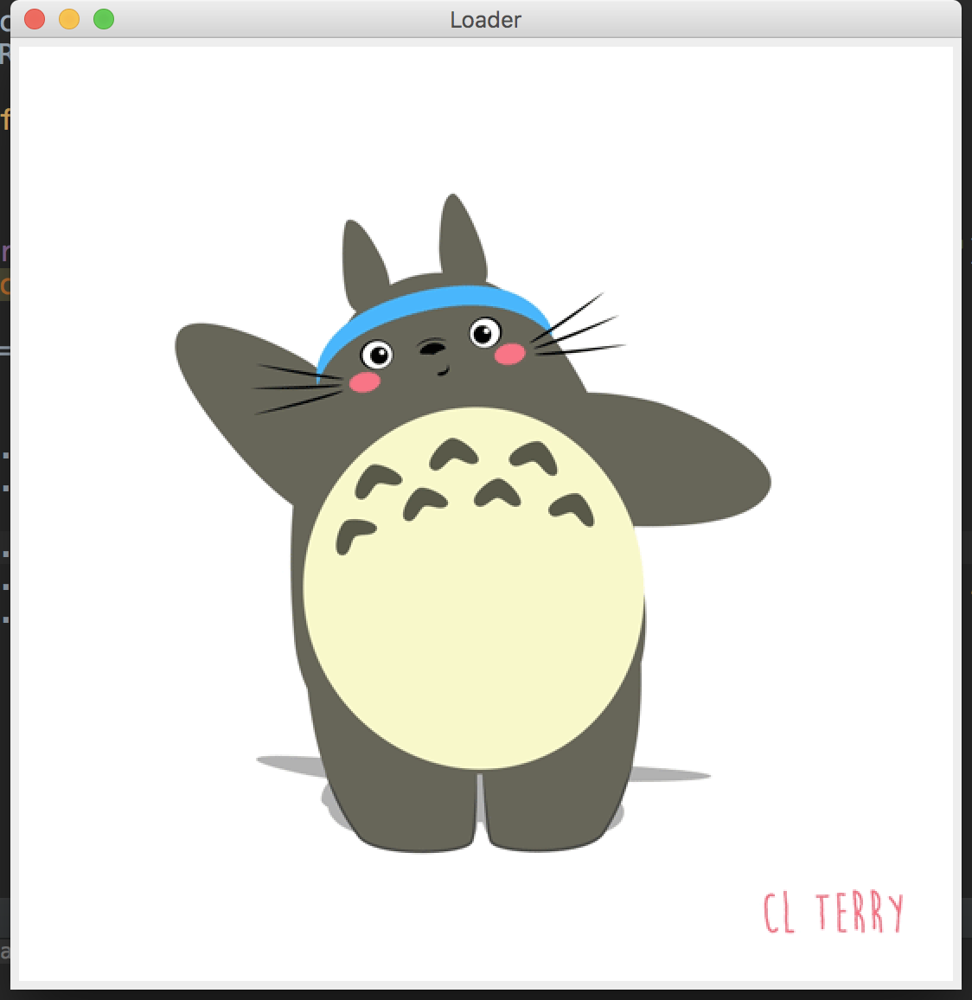

Animated gifs are just all over the internet these days. Especially after people realized picture comments ain't enough for their social networking experience. Gifs are pretty good at expressing things in short - just like those tiny stories that float around on social networks. So how do you load them in a Java application? Or let's say you want a gifloader that loads the gif of your choice?

## Animated Gif Loader !!! Ting Ting Ting!!!!

We'll write a simple animated gif loader using Java Swing components. We just need a `JFrame`, a `JLabel` and that's it!

For testing whether our loader works or not we'll use this animated gif : <a href="http://i.giphy.com/xT0GqdXpoKAazgF8t2.gif" target="_blank">TotoroGif</a>

## How it'll look like?

We expect something like this :



## Breaking down the procedure

JLabel can have Icon objects set to them as Icons. So what we're going to do here is that we're going to load the animated gif from the URL given earlier into an URL object. Then instantiate an Icon object with the URL. Finally, set the Icon object to the JLabel.
Now here's a catch. To make sure you get the animated gif and not a static frame or image, you've to load it as a stream via URL object and some exception handling will need to be taken care of. Let's just keep things simple and use generic exception handlers.

## What about the size of the JFrame?

Unless you know the size of the animated gif, it's better to use pack() and let Swing do the work for you. Why take the hassle of measuring things? Chill!

## CODE

```java
import javax.swing.*;
import java.net.URL;

public class GifLoader {
    private JFrame frame;
    private JLabel label;
    private Icon icon;
    private URL url;

    public GifLoader() {
        initGUI();
        addWindowProperties();
    }

    private void initGUI() {
        frame = new JFrame("Loader"); // windows title is Loader, change
                                      // it if you don't like it!

        try {
            url = new URL("http://i.giphy.com/xT0GqdXpoKAazgF8t2.gif");
        } catch (Exception e) { // do nothing or just print a message }

        icon = new ImageIcon(url);
        label = new JLabel(icon);
    }

    private void addWindowProperties() {
        frame.add(label);
        frame.pack(); // you don't know the size of the gif, so pack
        frame.setDefaultCloseOperation(WindowConstants.EXIT_ON_CLOSE);
        // you can also use JFrame.EXIT_ON_CLOSE
    }

    public void loadApplication() {
        frame.setVisible(true);
    }
}
```

## What does what here?

`initGUI()` instantiates the Swing components and the URL and the Icon and `addWindowProperties()` sets the `JFrame` properties. Both of them are called with the constructor to `class GifLoader`.

`loadApplication()` makes the `JFrame` visible on screen. It wasn't really necessary since we could've done inside `addWindowProperties()` but this makes sure our code is clean!

## Let's run it shall we?

Let's create another class where we'll create an object of the `class GifLoader` and instantiate it and call the `loadApplication()` method to run our Animated Gif Loader.

```java
public class Main {

    public static void main(String[] args) {
        GifLoader a = new GifLoader();
        a.loadApplication();
    }
}
```

## And that's it!

We're done! You can tweak the frame properties and set different things. You can even go and add a textbox as address bar and a button to load so that any  animated gif can be loaded.(just make sure it's streamable!)

**This article was originally published [here](https://rockash93.wordpress.com/2016/07/09/an-animated-gif-loader-in-java/).**
