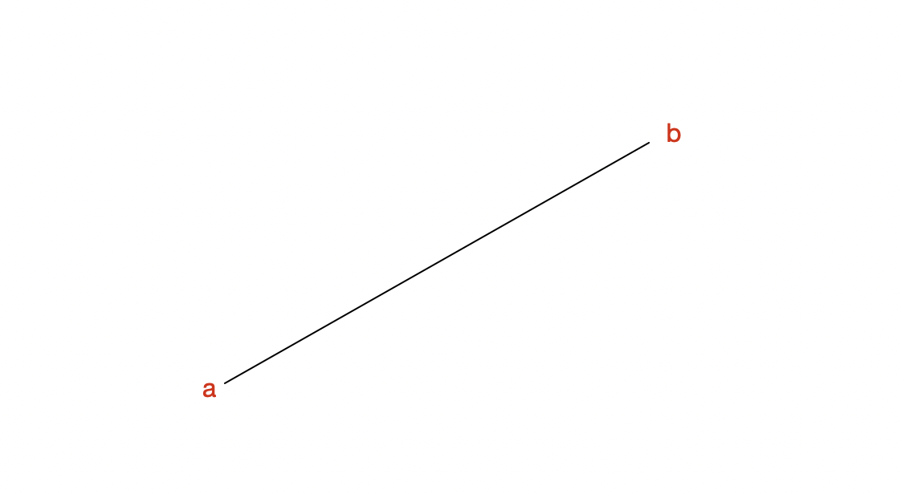
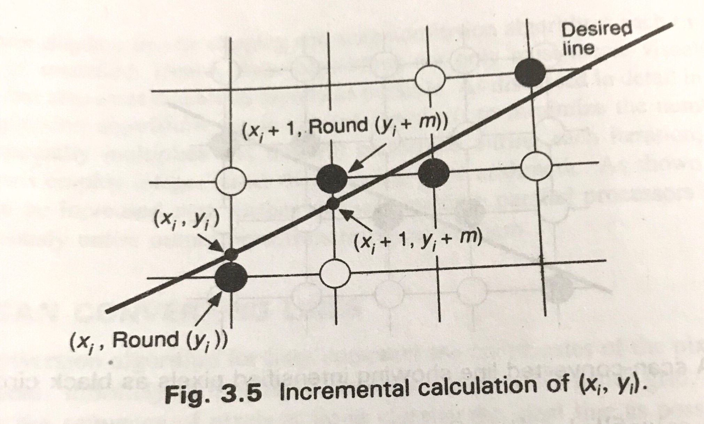
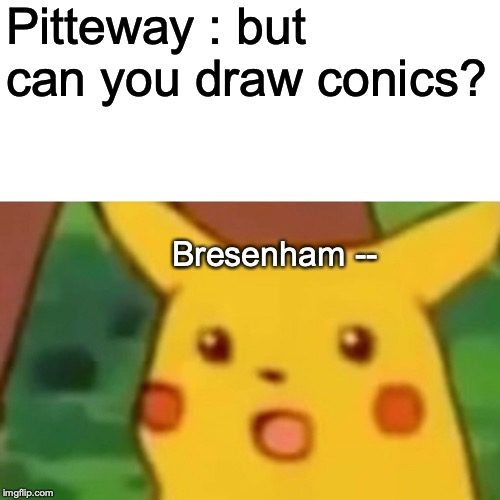
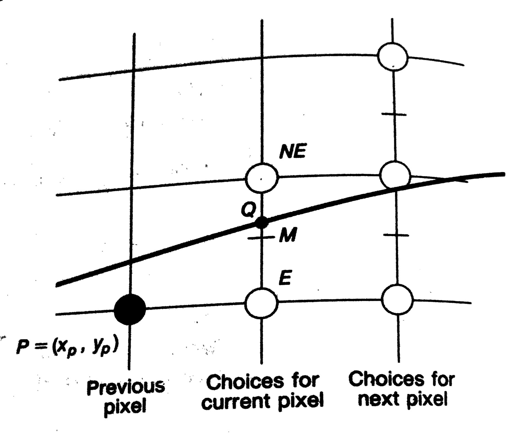

## শুরু করার আগে, লাইন বা সরলরেখা খাতায় ক্যামনে আঁকে?

স্কুল কলেজে তো অনেক লাইন এঁকেছেন, লাইন মেরেছেন, লাইন টেনেছেন। মহাবিশ্বে লাইনের অবদান এবং গুরুত্ব অনস্বীকার্য। এড়িয়ে যাবার উপায় নেই। কিন্তু এই মহাবিশ্বে কোনকিছু তো নিয়মের বাইরে চলে না। যে জিনিসের ব্যাখ্যা নেই কয়দিন বাদে কোন বেয়াড়া বিজ্ঞানী এসে সে জিনিসের জন্যও কয়েকটা সমীকরণ লিখে একটা ব্যাখ্যা দাঁড় করিয়ে দিবে। সরলরেখা বা লাইনের জন্যও কিন্তু একটা বেশ নিরীহদর্শন সমীকরণ আছে। স্কুলে পড়ে না থাকলে কলেজে স্থানাংক জ্যামিতির সাথে অবশ্যই পড়েছেন!

```bash
y = mx + c
যেখানে m = সরলেখার ঢাল,
c = কোন একটা বেয়াড়া সংখ্যা
```

<br>

ধরা যাক আপনাকে দুটি বিন্দু দেয়া হলো। একটার নাম a, আরেকটার নাম b । কাগজে আঁকলে আপনি কি করতেন? a থেকে b পর্যন্ত একটা ধাপ করে রেখা টেনে দিতেন।



কাগজে আঁকার সময় তো আপনাকে এত সমীকরণের হিসাব নিয়ে চিন্তা করা লাগতো না। কিন্তু সমীকরণ যখন আছে, সেটা ব্যবহার করে যদি লাইনটা আঁকতে হতো , ধরুন আপনাকে একটা গ্রাফ পেপার দিয়ে বললাম লাইনটা আঁকতে। কি করবেন ?
আপনি একের পর এক x এর মান বসিয়ে y এর মান বের করতেন , গ্রাফ পেপারে বসাতেন। ধরে নিন আপনাকে m এর জন্য একটা নির্দিষ্ট মান বলে দেয়া আছে। ব্যস হয়ে গেলো!
কিন্তু ধরেন আপনাকে বলে দেয়া হলো a , b দুটি বিন্দুর ই কার্তেসিয়ান স্থানাংক আছে। (কার্তেসিয়ান স্থানাংক কি না জানলে এটুকু মাথায় রাখেন যে গ্রাফ পেপারে যে সিস্টেম ইউস করেন সেটাই কার্তেসিয়ান কোঅরডিনেট সিস্টেম)। এখন আপনি কি করবেন? ধরা যাক স্থানাংক এমন —

```bash
a(x,y)
b(p,q)
```

খুব সহজভাবে চিন্তা করলে আপনি আগে এই দুইটা বিন্দু গ্রাফ পেপারে বসাবেন। এরপর স্কেল টেনে দিবেন। ব্যস লাইন হয়ে গেলো। কিন্তু আপনাকে যদি আগের মতন একের পর এক x এর মান বের করে এরপর সেটা দিয়ে লাইন আঁকতে বলে ? আপনার কিন্তু ঢাল জানা লাগবে । ঢাল ক্যামনে বের করে? কলেজ ম্যাথ রিফ্রেশার। দুই বিন্দুর স্থানাংক থাকলে ঢাল হবে —

```bash
m = (p - x) / (q - y)
```

মানে দুই বিন্দুর x আর y স্থানাংকের পার্থক্য। ঘুরে ফিরে কিন্তু সমীকরণ তাই রইলো ! সেই আদি y = mx + c , আপাতত c কে বাদ দিন । এর ব্যাপারে পরে ভাবা যাবে । আর লাইন যদি (0,0) দিয়ে একবার যেতে পারে c এমনিতেই নাই হয়ে যাবে । এখন এই যে কাজ করলেন এইটাকে যদি সুডোকোড আঁকারে লেখি তাহলে কেমন দাঁড়াবে?

```bash
let a(x, y), b(p, q)
dx = p - a
dy = q - y
c = // some value you already have
slope = dy / dx
for ( i = x to dx ):
  y = slope * i + c
  draw the point on (x, y)
done!
```


## এখন কম্পিউটার কীভাবে আঁকে? — লাইন স্ক্যানার

আপনি যদি আদি আমলের প্যানাসনিক ,নিপ্পন, ন্যাশনাল কিংবা সিংগারের নব ঘোরানো , ঝিরঝির করলে কয়েকটা থাবড় দিয়ে ঠিক করতে হয় এমন টিভি দেখে থাকেন (তাহলে আপনি আমার মতই বেশ বুড়া, নাহলে আপনি বিটিভির স্বর্ণযুগ মিস করেছেন) তাহলে মনে করে দেখেন, কোন কারণে টিভির সিগন্যাল দূর্বল হয়ে গেলে পর্দায় একের পর এক লাইন দেখা যেত। ট্রিনিট্রন প্রযুক্তি আসার আগ পর্যন্ত এটা খুব কমন ব্যাপার ছিলো। এই লাইনগুলোকে বলা হতো স্ক্যান লাইন। কম্পিউটার গ্রাফিক্সের খুব ফান্ডামেন্টাল টেকনিক গুলোর একটা। লাইন স্ক্যানিং কীভাবে কাজ করে ?

একটা কালো রঙের কাগজ নিন। তাতে কালি নেই এমন একটা কলম দিয়ে আঁকিবুঁকি করুন । একটু জোরেশোরেই করুন যাতে কাগজে দাগ পড়ে। এরপর কাগজের উপর পাউডার (ট্যালকম বা চক পাউডার যেটা খুশি) । দেখবেন আপনি যে আঁকিবুঁকি করেছেন সেগুলো সুন্দর দেখা যাচ্ছে । আপনি পাউডার দিয়ে ম্যানুয়ালি লাইন স্ক্যানিং করলেন একটা। লাইন স্ক্যানিং এই কাজটাই করে। উপর থেকে নিচ পর্যন্ত চেক করে যাবে, স্ক্রীনে আঁকার মতন কিছু পেলে সেটা আঁকবে, স্ক্রীনে দেখা যাবে, না থাকলে ঐ জায়গাটা ফাঁকা থাকবে। কম্পিউটার বা টিভি স্ক্রীন পয়েন্ট বলতে বুঝে পিক্সেল । যদি পিক্সেলে আঁকার মতন তথ্য না থাকে, লাইন স্ক্যানার সেটা এড়িয়ে যাবে।

লাইন স্ক্যানার যত পুরনো কিংবা নতুন ই হোক না কেন তাকে একটা নির্দিষ্ট অ্যালগোরিদম মেনেই কাজটা করতে হয়। এবং আপনি যে অ্যালগোরিদম ই লাইন স্ক্যানারে দেন না কেন, সরলরেখার সমীকরণ ঐ একটাই থাকবে । আপনার স্ক্রিন যে কোম্পানি খুশি বানাক, ফান্ডামেন্টাল থিওরি বদলাবে না (যদি না আপনি সরলরেখার জন্য আরো ভালো একটা সমীকরণ আবিষ্কার করতে পারেন।)

এখন আসেন দেখি উপরে যে সুডোকোড লিখেছিলাম সেটার জন্য যদি C++ এ কোড লেখি সেটা কেমন দাঁড়াবে —

```cpp
void drawNaive(Point a, Point b) {
    double dx = b.x - a.x;
    double dy = b.y - a.y;

    double slope = dy / dx;
    int x;
    double y = a.y;

    auto round = [](double y) {
        return std::floor(0.5 + y);
    };

    for (x = a.x; x < b.x; x++) {
        drawPoint(x, round(y));
        y += slope;
    }

}
```

## কিন্তু এখানে হচ্ছেটা কি?

<figure>
  
  <figcaption>Computer Graphics Principles and Practice in C — Foley et al.</figcaption>
</figure>

লাইন খাতায় আঁকতে গেলে আপনি অবচেতন মনে যেটা করেন যে, আপনি ঢাল কীভাবে কাজ করছে সেটা নিয়ে বিশেষ একটা মাথা ঘামান না। আদতে ঢালের কাজ কি? খুব সহজ ভাষায় বললে ঢাল ডিফাইন করে আপনার লাইনটা কীভাবে সামনের দিকে যাবে। মানে বেসলাইন থেকে কতটা উপরে বা নিচে সরে যাবে। এজন্য সচরাচর বলা হয় ঢাল হচ্ছে আপনার সরলরেখা x অক্ষ থেকে কোন অ্যাঙ্গেলে সরে থাকবে।

এখন লাইন স্ক্যানার যখন y এর মান বসাতে থাকবে তখন তাকে এইটা বের করতে হবে যে পরবর্তী y এর মানটা কই বসবে। বেসলাইন এর দিকে নেমে যাবে নাকি উপড়ের দিকে যাবে । এই সিদ্ধান্ত নেয়াটা বেশি গুরুত্বপূর্ণ। আপনার লাইন ঠিকভাবে স্ক্রীনে আসবে কিনা এই সিদ্ধান্তের উপরই নির্ভর করে। এজন্য লাইন স্ক্যানার যেটা করে যে সে প্রতিবার x এর মান সামনে বাড়ানোর সাথে সাথে y এর মান বাড়াতে গিয়ে আগে দেখবে যে লাইন উপরে যাবে নাকি নিচে এবং সেভাবে লাইন আঁকবে । ব্যাপারটাকে সিঁড়ি বেয়ে উপড়ে ওঠার সাথে তুলনা করতে পারেন। সিঁড়ির প্রতি ধাপে আপনাকে একটু একটু করে উপড়ে উঠতে হচ্ছে।

এখন প্রশ্ন হচ্ছে এই যে এলেভেশন / ডিমোশন (উপড়ে বা নিচে যাওয়া যেটাই বলি না কেন) সেটার জন্য কি করা যায়? এজন্য ডিফাইন করা হয় যে ঢালের মান ০ থেকে ১ এর মাঝে থাকবে । কেন? (বিভিন্ন কোণের জন্য tangent এর মান দেখুন, বুঝে যাবেন)। এবং মিড পয়েন্ট ধরা হয় 0.5 কে। এরপর যখন বিন্দু বসানো হবে, y এর মানের সাথে 0.5 যোগ করে সেটাকে রাউন্ডিং করে নেয়া হয় । এই কাজটা করা হয় যাতে আপনি যে নতুন বিন্দুটা আঁকছেন সেটা এস্টিমেটেড লাইনের খুব কাছে থাকে এবং খুব বেশি বিচ্যুতি না দেখা যায়। (লো রেজুলেশন ডিস্প্লে এর পিক্সলেটেড গ্রাফিক্স দেখলেই বুঝবেন যে বিচ্যুতি কেমন হয়)। এই জিনিসটাকে বলে ক্লোজেস্ট পয়েন্ট এস্টিমেট করা। তাই প্রতিবার (x, y) না একে আমরা আঁকছি (x, y এর রাউন্ড করা ভ্যালু) এবং প্রতিবার উপর নিচ ঠিক করার জন্য y এর সাথে ঢাল যোগ করে দিচ্ছি।

## নাম Naive কেন ?

কারণ এই অ্যালগরিদমের অনেক সমস্যা আছে।

- এইটা ব্রুট ফোর্স অ্যালগোরিদম। একের পর এক পয়েন্ট স্ক্যান করে যাবে। মেমোরি , প্রসেসর সাইকেল দুইই অপচয় হবে। গ্রাফিক্স প্রোগ্রামিং এ মেমরি বেশ গুরুত্বপূর্ণ। কারণ গ্রাফিক্স মেমরি সস্তা না।

- গুণ, ভাগ, ডাবল কিংবা ফ্লোটিং পয়েন্ট এরিথমেটিক কম্পিউটেশন বেশ রিসোর্স ইন্টেনসিভ। এককালে এমন সব প্রসেসর পাওয়া যেত যেগুলো ইন্টিজারের বাইরে কোন কিছু নিয়ে কাজ করতে পারতো না। তাছাড়া, প্রসেসর, আর্কিটেকচার ভেদে ফ্লোটিং পয়েন্ট ক্যালকুলেশনে একেক রকম ভ্যালু আসতে পারে। দেখা যাবে আপনার কম্পিউটারে সুন্দর লাইন দেখাচ্ছে আরেকজনের লো পাওয়ার ডিভাইসে দেখাচ্ছে অন্য কিছু।

- খেয়াল করুন, প্রতিবার ভ্যালু রাউন্ডিং করতে হচ্ছে, ফ্লোর ভ্যালু নিতে হচ্ছে। একটা সামান্য লাইন আঁকার জন্য যদি এত হ্যাপা নিতে হয় তাহলে কমপ্লেক্স স্ট্রাকচার আঁকতে কি করা লাগবে ?

**এই অ্যালগোরিদম এফিশিয়েন্ট না। তাহলে এফিশিয়েন্ট অ্যালগোরিদম কোনটা ?**

## ব্রেজেনহামের অ্যালগোরিদম

ব্রেজেনহাম একটা ভালো অ্যালগোরিদম প্রস্তাব করলেন । তার কথা ছিলো কি দরকার ফ্লোটিং পয়েন্ট ভ্যালু নিয়ে কাজ করার ? আমরা বরং এইটা চিন্তা করি যে পরবর্তী y খোঁজার কাজটা কীভাবে এফিশিয়েন্ট করা যায়। উনি একটা নতুন জিনিস যোগ করলেন । তাঁর কথা ছিলো বাপু এত কষ্ট করে নিয়ারেস্ট y খোঁজার চাইতে সরলরেখার ঢাল থেকে একটা Threshold সেট করে দাও না। সেটা ক্রস করলে উপড়ে যাবে নাহলে নিচে চলে যাবে! কি দরকার y কই হবে কি হবে সেটা নিয়ে এত হাঙ্গামা করার ?

ব্রেজেনাহামের অ্যালগোরিদম অনুযায়ী Threshold এর মান হবে 0.5, একটা ভেরিয়েবল- যার মান ০ থেকে শুরু হবে, ট্র্যাক রাখবে রেখাটা উপরে যাচ্ছে নাকি নিচে । এবং কীভাবে আমরা এইটা ট্র্যাক করাবো? প্রতি ইটারেশনে দেখবো এই ভেরিয়েবলের মান Threshold এর বেশি কিনা । বেশি হলে উপড়ে যাবে নতুবা যা আছে তাই রেখে দাও। উনার অ্যাজাম্পশনের বেইস ছিলো যে সরলরেখা তো আর মাঝপথে ঢাল বদলাতে পারবে না, যেটা উপরে যাচ্ছে সেটা উপরেই যাবে।

C++ এ লিখলে এমন দাঁড়াবে —

```cpp
void drawUsingBresenhamFloat(Point a, Point b) {
    int dx = b.x - a.x;
    int dy = b.y - a.y;
    double m = abs(dx / dy);
    double error = 0;

    int y = a.y;

    // if number is positive 1, -1 if negative, 0 if 0
    auto sign = [](int number)
    {
        int returnValue = 0;
        if (number > 0) {
            returnValue = 1;
        } else if(number < 0) {
            returnValue = -1;
        }

        return returnValue;
    };


    for (int x = a.x; x < b.x; x++) {
        drawPoint(x, y);
        error += m;
        if (error >= 0.5) {
            y += sign(dy);
            error--;
        }
    }
}
```

সেই ফ্লোটিং পয়েন্ট ই তো রইলো! আমাদের না ফ্লোটিং পয়েন্ট এড়ানোর কথা ছিলো ? ব্রেজেনহাম সাহেব সে ব্যবস্থাও করেছেন । তার অ্যালগোরিদম শুধুমাত্র ইন্টিজার দিয়েও ইমপ্লিমেন্ট করা সম্ভব । সেক্ষেত্রে যে error হিসাব করছি সেটা একটু ভিন্নভাবে করতে হবে। ইন্টিজার অ্যালগোরিদম টা বুঝানো একটা মুশকিল। তাছাড়া এর জন্য ব্রেজেনহামের ডেরিভেশনটাও দেখতে হবে । সেজন্য আমি আগে ফ্লোটিং পয়েন্ট টা দেখিয়েছি। এখন দেখা যাক ইন্টিজার ভার্শনটা কেমন হবে। ফ্লোটিং পয়েন্টের ঝামেলা এড়ানোর জন্য ব্রেজেনহাম 2 দিয়ে গুণ করে দেয়ার কথা বলেছিলেন । এ বিষয়ে [ইউটিউবে Brian Will এর একটা বেশ সুন্দর ভিডিও আছে।](https://youtu.be/IDFB5CDpLDE) দেখে নিলে আরো ক্লিয়ার হবে।

```cpp
void drawUsingBresenhamInt(Point a, Point b) {
    int dx = b.x - a.x;
    int dy = b.y - a.y;
    int d = 2 * dy - dx;
    int y = a.y;

    for (int x = a.x; x < b.x; x++) {
        drawPoint(x, y);
        if (d > 0) {
            // go upwards
            y++;
            d -= 2 * dx;
        }

        // update d
        d += 2 * dy;
    }
}
```

[ডেরিভেশনটা এখান থেকে](https://en.wikipedia.org/wiki/Bresenham%27s_line_algorithm) দেখে নিতে পারেন । কিন্তু ব্রেজেনহাম সাহেবের অ্যালগোরিদমের প্রবলেম ছিলো যে এই জিনিস দিয়ে বৃত্ত কিংবা কনিক আঁকতে গেলে ভালো রেজাল্ট পাওয়া যেত না। এইটা একটা বেশ বড় সমস্যা ছিলো। এর সমাধান দিয়েছিলেন পিটওয়ে এবং ভন অ্যাকেন । তারা একটা নতুন অ্যালগোরিদম দিলেন । নাম মিডপয়েন্ট অ্যালগোরিদম ।



## পিটওয়ে এর মিডপয়েন্ট অ্যালগোরিদম

<figure>
  
  <figcaption>Computer Graphics Principles and Practice in C — Foley et al.</figcaption>
</figure>

পিটওয়ে সাহেবের অ্যালগোরিদম টা কিঞ্চিত জটিল । উনি ব্রেজেনহামের মতন ধরে নেননি যে লাইন কখনো নিজের ঢাল বদলাবে না (যেমন বৃত্ত কিংবা কনিকে , যেখানে প্রতি বিন্দুর ঢাল আলাদা হয়)। উনি ভিন্নভাবে চিন্তা করলেন যে সব সমস্যা তো ঐ y এর মান নিয়েই, তাহলে এইভাবে দেখা যাক, ঢাল হিসাব করার দরকার ই নেই, থ্রেশোল্ড নিয়ে মারামারির ও দরকার নেই। যেহেতু পুরো স্ক্রিনটাই একটা গ্রাফ পেপারের মতন রেক্টাঙ্গুলার গ্রিড, এবং লাইনকে গ্রিডের সেল পার করেই যেতে হবে, তাহলে সেলের মাঝে এমন একটা বিন্দু নিবো যেটাকে বলবো মিডপয়েন্ট (M)। এরপর দেখবো আবার লাইন মিডপয়েন্টের উপরে আছে নাকি নিচে । যদি উপরে থাকে, তাহলে উপরে যাবে। নিচে থাকলে নিচে। এই অ্যালগোরিদম যদি C++ এ লেখি এমন দাঁড়াবে। ভালো হয় যদি এর [ডেরিভেশনটাও](https://academic.oup.com/comjnl/article/10/3/282/494116) দেখে আসতে পারেন । যথেষ্ট বড় ডেরিভেশন, সেটা এখানে ডিসকাস করে আপনার আমার ভেজা ফ্রাই করার মানে হয় না ।

```cpp
void drawUsingMidpointTechnique(Point a, Point b) {
    int dx = b.x - a.x;
    int dy = b.y - a.y;

    int d = 2 * dy - dx;
    int lower = 2 * dy;
    int rise = 2 * (dy - dx);

    int x = a.x;
    int y = a.y;

    drawPoint(x, y);

    for (int i = 0; i < dx; i++) {
        if (d <= 0) {
            // go down
            d += lower;
            x++;
        } else {
            // go up
            d += rise;
            x++;
            y++;
        }
        drawPoint(x, y);
    }
```

## এই কোড রান করাবো ক্যামনে ?

এবার আসি আসল কথা। এই জিনিস রান করাবেন কীভাবে ? রান করাতে আপনার কম্পিউটারে অবশ্যই একটা C++ কম্পাইলার থাকতে হবে। এছাড়া লাগবে OpenGL. এখন আপনার অপারেটিং সিস্টেমের জন্য সরাসরি OpenGL বাইনারি নাও থাকতে পারে (যেমন উইন্ডোজ)। সেজন্য একটা থার্ড পার্টি লাইব্রেরি ইউস করতে পারি। আপনি যদি macOS ইউজার হন এবং আপনার এক্সকোড ইন্সটল করা থাকে আপনার বিশেষ একটা ঝামেলা পোহাতে হবে না। সব দেয়াই আছে। উবুন্টু কিংবা অন্য লিনাক্স ডিস্ট্রিবিউশন এর ইউজারেরা freeGLUT করে নিতে পারেন। উইন্ডোজের জন্য freeGLUT/ GLEW/ GLFW যেকোনোটা ইউস করতে পারেন । ওদের ওয়েবসাইটে সব ইন্সট্রাকশন পাবেন ।

এখন আসি কীভাবে কম্পাইল করবেন।

```bash
# macOS
g++ main.cpp -std=c++17 -framework GLUT -framework OpenGL -o main
# linux
g++ main.cpp -std=c++17 -lGL -lGLU -lglut -o main
```

আপনি যদি CLion কিংবা Xcode (macOS) ইউজার হন তাহলে এই পোস্টের জন্য বিটবাকেটে রিপোজিটরি করা আছে সেটা ক্লোন করেও চালাতে পারেন । জাস্ট আইডি ওয়াইজ প্রোজেক্ট ওপেন করে নিবেন।

## কোর্ডিনেট ইনপুট দেয়া

কোডে `display` নামে একটা ফাংশন পাবেন । ওর ভেতরে পয়েন্টের কোর্ডিনেট দিয়ে দিবেন । `Point` এর জন্য `struct` ডিফাইন করা আছে।

```cpp
static void display(void)
{
    glClear(GL_COLOR_BUFFER_BIT | GL_DEPTH_BUFFER_BIT);
    glColor3d(1,1,1);

    Point a, b;
    // point data
    a.x = 0; a.y = 0;
    b.x = 200; b.y = 100;


    glPushMatrix();
    drawLine(a, b);
    glPopMatrix();

    glutSwapBuffers();
}

```

## শেষ!

কম্পিউটার গ্রাফিক্স বিশাল বড় একটা ফিল্ড। আপনি যদি এই বিরক্তিকর পোস্ট পড়ে, একগাদা সমীকরণ দেখে আরো ঘাটাঘাটি করতে ইন্টারেস্ট পান তাহলে Edx, Coursera তে ভালো কিছু কোর্স আছে। এছাড়া রেফারেন্স ম্যাটারিয়াল গুলো পড়তে পারেন।


## রেফারেন্স

- Computer Graphics Principles and Practices in C, Foley et al, 2nd edition.
- Algorithm for drawing ellipses or hyperbolae with a digital plotter, Pitteway, The Computer Journal, Volume 10, Issue 3, 1 January 1967, Pages 282–289.
- https://www.cs.helsinki.fi/group/goa/mallinnus/lines/bresenh.html
- [Bresenham’s line algorithm](https://en.wikipedia.org/wiki/Bresenham%27s_line_algorithm)

## কোড রিপোজিটরি

- https://bitbucket.org/shawon_ashraf/linedrawingopengl/src/master/

<em>এই পোস্টটি আমার <a href="https://medium.com/@sashraf94/কম্পিউটার-লাইন-ক্যামনে-আঁকে-cc7992d3a29e">মিডিয়াম ব্লগেও</a> পড়তে পারেন</em>
