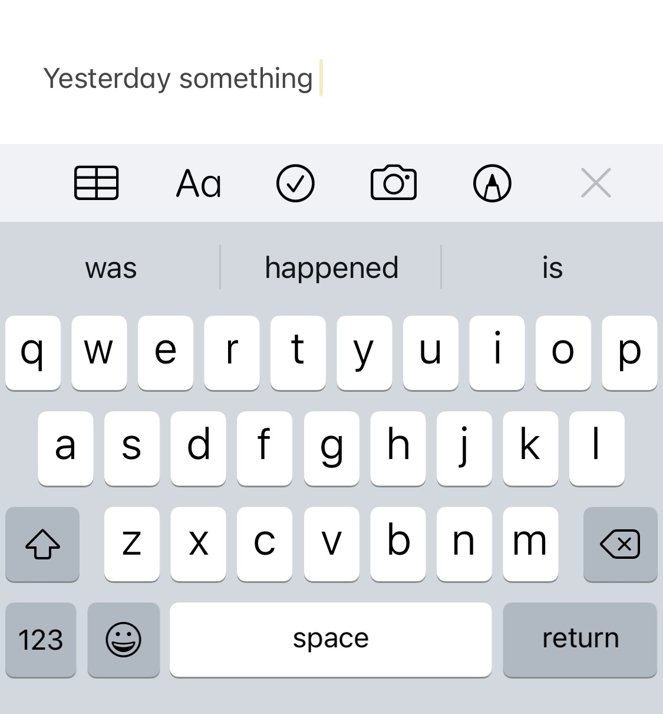

## The autocomplete

How many times has the autocomplete feature on your phone's keyboard app saved (or sometimes ruined, depending on what you wanted to type) your conversations? Judging from the number of texts and emails we sent around everyday, the number would be staggering and you may not even count it as something significant because you've grown so used to this often overlooked and underrated piece of technology. And you may even go on and say, "Eh, what's so special about it anyway, it's so simple, I write a word and it predicts the next thing."



Trust me, it just looks simple. Actually it isn't. There's a lot of work behind this seemingly simple thing to bring you the convenience of having to save some keystrokes while having that big argument online. Let's demystify the seemingly simple yet not simple nature of this autocomplete thing.

## It just predicts...

**Predict** is a complex word. Because it comes with a lot of baggings. What kind of prediction are we talking about? And predict based on what? And how's the prediction going to work? A lot of questions. So let's pick one easy answer for all of them. Prediction is done based on some probability of something happening. If the weather report says that it's going to rain tomorrow, they're stating the probability that it _"might"_ rain tomorrow. How do they do so? Based on the rain records of the past few years. Or perhaps many years. You get the idea.

So when you write a word on your phone, have you noticed how words that can match that word most just show up instantly? It's because the underlying piece of software tries to predict which word you may write next. Now it won't always be correct, but it's going to try its best to come up with a list of words that best compliment what you've written before.

**So to speak, autocomplete is just predicting what you may write next!** Or, we can say autocomplete generates the next most probable word that goes on with whatever we've written already. And when it comes to generating text based on probability - there's a special topic in **NLP** called **Language Models.**

## What is a language model?

The Wikipedia definition for Language Models[^ https://en.wikipedia.org/wiki/Language_model] is somewhat less inspiring to understand the importance of the topic but let's start with that anyway.

> A statistical language model is a probability distribution over sequences of words. Given such a sequence, say of length m, it assigns a probability $P(w_{1},\ldots ,w_{m})$ to the whole sequence.

Yeah....probability. Okay. Let's get on it. What a language model does is, for some text (can be a line or a paragraph or any arbitrary length of text) it assigns probability scores for the words or characters. But what are these scores based on? Good question. The answer is, they can be based on any criteria but the most probable use case of language models is to find out how probable it is for one word to come after another in a language. Let's take the following sentence for an example.

```bash
I ate burger.
```

Your curious mind may be asking, why burger and not Biriyani? Perhaps I could've eaten Schnitzel. Or may be Döner Kebap. Or a plethora of other things. Your mind tried to pick the word that can be used in place of `burger` almost instantly. Because, there are a lot of things a person can eat right? And the huge natural selection and evolution hardened brain database can easily link `ate` to a possible list of food items.

Okay let's simplify it. Let's just forget that we've only this sentence

```bash
ate ___________
```

Fill in the blank after the word ate. How many words can you come up with from your knowledge. Now, ask yourself, why should there be only food items or consumables after the word ate? Why can't you write Car, Mountain, TV etc.? Because the knowledge base in your brain says - "Man, it doesn't make sense to eat a car." **Or, your brain assigns a very low probability for someone to eat a car.** So low that it no longer seems reasonable or significant.

So back to the topic of Language Model at hand. It assigns probability for some text. Language models can be used from translation (yes Google Translate uses an advanced Language Model) to question answering to autocomplete - anywhere you need to generate words or text or predict them.

For autocomplete as you'd have understood already, we're looking at one word and trying to predict the next one. So if I take the first sentence `I ate burger.` and try to model it based on how probable each word is based on the previous one - it should become something like this in the form of an equation:

Before we write the equation, let's add some symbols to the sentence. Why so? Coming to that shortly!

$$
\text{BEGIN I ate burger END}
$$

Now for the equation -

$$
P(burger | I ate) = P(I | BEGIN) * P(ate | I) * P(burger | ate)
$$

## Wait isn't that conditional probability?

Yes. Every word exists based on the prior that the previous one exists. In fact, there's a name for this kind of conditional probability based Language Modelling. These are called **Markov Models.**

> While the task of modeling a single word based on its left context seem more manageable than assigning a probability score to an entire sentence, the last term in the equation still requires conditioning on $n – 1$ words, which is as hard as modeling an entire sentence. For this reason, language models make use of the markov-assumption, stating that the future is independent of the past given the present.

[^ Goldberg, Yoav. Neural Network Methods for Natural Language Processing (Synthesis Lectures on Human Language Technologies) (pp. 105-106). Morgan & Claypool Publishers. Kindle Edition.]

Markov Models state that the next element in a sequence is based on what came before it. Now that begets the question that we only considered the previous word. What if there were more words? Is there a standard definition on how many words we can choose to get a prior probability? The answer is no, there's no standard definition for this. This number of words you're asking about, is called the **window size**. Window size can vary depending many factors, the amount of text you have and etc. and the value of the Window can impact your prediction results directly. Also there's another thing beside Window Size.

## n-grams

If you look at the equation above we're only considering a **combination of two words**. For example $\text{burger} | \text{ate}$. A combination of two words like this is called a **Bigram**. Had we considered three words, it'd be called a **Trigram**. Four ? Tetragram and so on. Hence this approach is called **n-grams**. Like window size, the number of grams will also have an effect on the probability if you're using a Markov Model.

## What about other sentences?

Let's say we stick to our approach and use bigrams and check for the previous word only. Then the equation for the language model for any sentence, $s$ with $n$ words would be -

$$
P(w | s) = \prod_{t = 1}^{n} P(w_{i} | w_{i - 1})
$$

Now what if we wanted to go for a Trigram? Then we'd have checked for the previous two words instead of one.

$$
P(w | s) = \prod_{t = 1}^{n} P(w_{i} | w_{i - 1}, w_{i - 2})
$$

## Wait, how to get a value for that probability?

I'm glad that you asked. We use a proven stable bulletproof statistical method called **Maximum Likelihood estimation**[^ https://en.wikipedia.org/wiki/Maximum_likelihood_estimation]. It has one job, figuring out how probable something is to happen is a related thing has happened already. Since we're talking about words, we do it like this:

Let's say we have a bigram consisting of the words $a$ and $b$ and we need the probability $P(b | a)$

$$
P(b | a) = MLE(a, b)
$$

$$
MLE(a, b) = \frac{Count(a, b)}{Count(b)}
$$

**When we say count we actually mean how many times they appear in a certain text dataset or corpus.**

## The corpus

For the uninitiated, a corpus is a structured, well defined and annotated dataset containing text. If you're into machine learning, you'd know what that means already. We as humans learn hundred of words and our languages have thousands or even millions of words in them. We can pick them easily because our brain has had thousand of years to train itself and pass down the training experience through the sharing of genes. Our computers are loners and don't have the luxury of having unlimited memory. They can only peek at a small subset of all the text out there at a time.

## What about the unconventional words I use on social networks?

Yeah about that. You may have noticed that the keyboard you use on your phone remembers what type of words you're using mostly. What happens there is that as you use the keyboard more and more it stores which words you use more and assigns a specific weight of significance to them so that they always get a higher probability than the other words.

## But Markovs ain't Kalashnikovs chief!

They've their limitations. While Markov Models[^ https://en.wikipedia.org/wiki/Markov_model] perform admirably well for small sentences and text datasets or corpuses, they start hiccuping when the sentences and corpuses start getting bigger. That's why for advanced real world tasks we tend to use **Neural Language Models** more these days. And there you get the option of more parameters than just some window size and n-grams.

Also, as you can see from the MLE equation above, we're using the **frequency of the words**. While it's fine to use frequency, oftentimes it may happen that you have a system trained on a corpus that lacks a word that was not present in the actual training corpus or the initial knowledge base the system shipped with. **The Count() for that word will be $0$ and your system will assign a $0$ probability for that word, which won't be really helpful because the system won't work as expected.** And trust me, nobody likes software that doesn't work. You can apply some common remedies to such systems like smoothing, using a special token for new words, or adding the new word to your knowledge base and etc.

For smoothing alone you can apply Laplace Smoothing, $\alpha$-smoothing [^ Stanley F. Chen and Joshua Goodman. An empirical study of smoothing techniques for language modeling. Computer Speech and Language, 13(4):359–394, 1999. DOI: 10.1006/csla.1999.0128.] [^ Joshua Goodman. A bit of progress in language modeling. CoRR, cs.CL/0108005, 2001. http://arxiv.org/abs/cs.CL/0108005 DOI: 10.1006/csla.2001.0174.], Jelinek Mercer Interpolated Smoothing [^ Frederick Jelinek and Robert Mercer. Interpolated estimation of Markov source parameters from sparse data. In Workshop on Pattern Recognition in Practice, 1980. ] [^ Stanley F. Chen and Joshua Goodman. An empirical study of smoothing techniques for language modeling. Computer Speech and Language, 13(4):359–394, 1999. DOI: 10.1006/csla.1999.0128.], Kneser Ney smoothing [^ Reinhard Kneser and Hermann Ney. Improved backing-off for m-gram language modeling. In Acoustics, Speech, and Signal Processing, ICASSP-95, International Conference on, volume 1, pages 181–184, May 1995. DOI: 10.1109/ICASSP.1995.479394.] and etc.

Another thing, as mentioned by Yaov Goldberg -

> MLE-based language models suffer from lack of generalization across contexts. Having observed black car and blue car does not influence our estimates of the event red car if we haven’t see it before.
>
> [^ Goldberg, Yoav. Neural Network Methods for Natural Language Processing (Synthesis Lectures on Human Language Technologies) (p. 108). Morgan & Claypool Publishers. Kindle Edition. ]

## This post is getting long

Yes yes. I know. I'll discuss Neural Language Models in the next part of this post. Till then, keep using your phone keyboards and make them work hard at predicting the next word!

## References and resources

- Joris Pelemans, Noam Shazeer, and Ciprian Chelba. Sparse non-negative matrix language modeling. Transactions of the Association of Computational Linguistics, 4(1):329–342, 2016. http://aclweb.org/anthology/Q16-1024
- Goldberg, Yoav. Neural Network Methods for Natural Language Processing (Synthesis Lectures on Human Language Technologies) .Morgan & Claypool Publishers.
- [StatQuest: Maximum Likelihood, clearly explained!!!](https://www.youtube.com/watch?v=XepXtl9YKwc)
- Stanley F. Chen and Joshua Goodman. An empirical study of smoothing techniques for language modeling. In 34th Annual Meeting of the Association for Computational Linguistics, 1996. http://aclweb.org/anthology/P96-1041 DOI: 10.1006/csla.1999.0128.
- [Wikipedia article on Additive smoothing](https://en.wikipedia.org/wiki/Additive_smoothing)
- [Jurafsky, Martin. Speech and Language Processing (3rd ed. draft)](https://web.stanford.edu/~jurafsky/slp3/)
- [Manning, Christopher. Foundations of Statistical Natural Language Processing (The MIT Press)](https://nlp.stanford.edu/fsnlp/)

You can also read this post on [Medium](https://medium.com/@shawonashraf/index-48563e4c1572).
