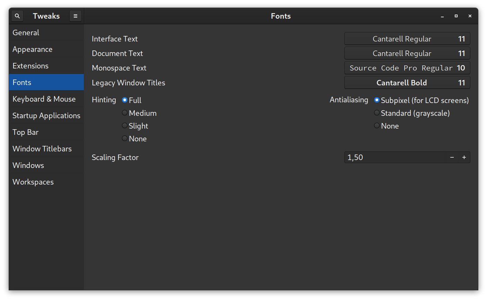
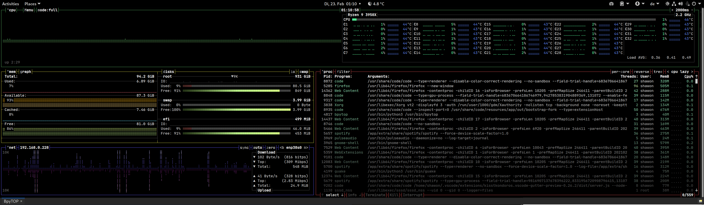
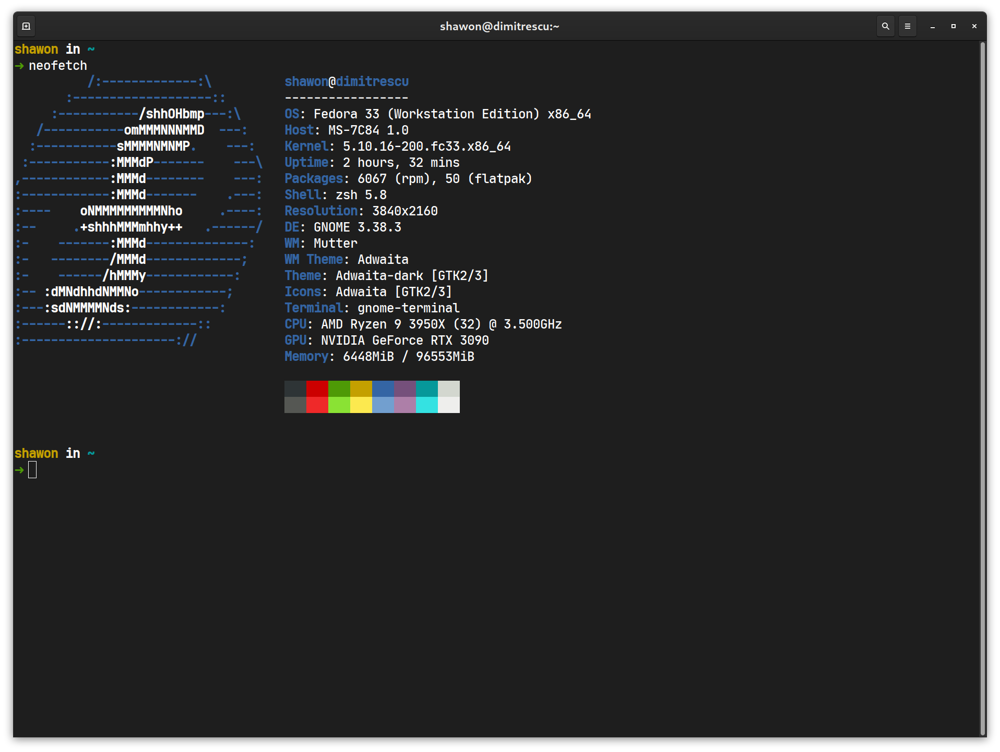

I recently installed Fedora on my workstation to make my home and lab computers consistent with each other. This is a simple post installation guide I followed. If you plan to use Fedora sometime in the future, check it out.

## Update system

```bash
sudo dnf update
```

## Add Windows to grub for dual boot

Fedora uses grub2 and it works different than ubuntu or other distros. You can't just run grub update and call it a day.

Run `os-prober` to check for other os entries.

```bash
sudo os-prober
```

Update grub entries

```bash
sudo grub2-mkconfig -o /boot/efi/EFI/fedora/grub.cfg
```

## Edit grub timeout

Edit `/etc/default/grub` and change `GRUB_TIMEOUT` to the desired value. The default is 5 (5 seconds). (Edit with sudo)

## Additional software repos

These can be enabled from Software Center as well. Whichever way you prefer!

### rpm-fusion

There are two repos to enable. The one with free software and the other with proprietary software. If you happen to have an Nvidia GPU or some hardware part that needs proprietary driver, you'll need the second one. Why not the free Nvidia driver? Because it's bad. Real bad. Apple Maps bad. Period.

```bash
sudo rpm -Uvh http://download1.rpmfusion.org/free/fedora/rpmfusion-free-release-$(rpm -E %fedora).noarch.rpm

sudo rpm -Uvh http://download1.rpmfusion.org/nonfree/fedora/rpmfusion-nonfree-release-$(rpm -E %fedora).noarch.rpm
```

### Flatpak

```bash
flatpak remote-add --if-not-exists flathub https://flathub.org/repo/flathub.flatpakrepo

flatpak update
```

### Snap

```bash
sudo dnf install -y snapd
sudo ln -s /var/lib/snapd/snap /snap # for classic snap support
sudo reboot now # needed to update paths. Snap is annoying!

# after reboot
sudo snap refresh
```

## Make dnf faster

Unlike apt or zypper or pacman, dnf doesn't look for the fastest mirror to download packages from by deafult. You've to explicitly tell it to do so.

Add the following line to your `/etc/dnf/dnf.conf` file. (Edit with sudo)

```
fastestmirror=true
```

## Improved fonts

Fedora maintainers have a strict policy of shipping only free and open source material with the distro. For this, you may miss out on some proprietary fonts used in many websites. Luckily you can enable them with this fedora community package package or copr package.

```bash
sudo dnf copr enable dawid/better_fonts

sudo dnf install -y fontconfig-enhanced-defaults fontconfig-font-replacements
```

## Gnome extensions and tweaks

I'm not a big fan of heavy customization and tweaks. This is one of the many reasons I like Fedora; it comes with absolute stock Gnome. But if you switch between Operating Systems a lot like me everyday, you may want to customize a bit. These two tools will give you all the power to customize your Gnome DE the way you want.

```bash
sudo dnf install gnome-extensions-app

sudo dnf install gnome-tweaks
```

Here is a list of the extensions I use:

- Auto Switcher
- Clipboard Indicator
- Dash to Dock
- No Topleft Hot Corner
- OpenWeather
- Removable Drive Menu
- Screenshot Tool
- Places Status Indicator
- User Themes
- https://extensions.gnome.org/extension/120/system-monitor/

You can install these from https://extensions.gnome.org/

You should also check out the customization options in the Tweaks app.

## Enable noise cancellation for supported head phones

Edit `/etc/pulse/default.pa` (again with sudo) and add these lines at the end of the file.

```bash
.ifexists module-echo-cancel.so
load-module module-echo-cancel aec_method=webrtc source_name=echocancel sink_name=echocancel1
set-default-source echocancel
set-default-sink echocancel1
.endif
```

Now restart pulseaudio for changes to take effect.

```bash
pulseaudio -k
```

## Proprietary multimedia codecs

You'll need these to play everyday music and video files. Because Fedora doesn't ship with proprietary software.

```bash
sudo dnf groupupdate Multimedia
```

## Applications

Which applications to install? Well that's upto you. I don't know your use case so can't suggest any. You can search around in Software Center and install applications as you see fit! However, I'd recommend installing these two. (both are command line based btw.)

- [bpytop](https://github.com/aristocratos/bpytop)
- [nvtop - for monitoring nvidia gpu usage](https://github.com/Syllo/nvtop) (you have to build it from source since the maintainers didn't release a package for Fedora, instructions in the repo)

## Default Shell

The default shell on most linux distros is bash and Fedora is no exception here. I personally prefer zsh with [oh-my-zsh](https://github.com/ohmyzsh/ohmyzsh) and [spaceship-prompt](https://github.com/denysdovhan/spaceship-prompt). Some people like the fish shell. It's completely upto you actually. Pick the one that better suits your workflow.

## Enable night light

If you've never used this thing yet on other operating systems you should now. You'll appreciate it in the long run. Go to _Settings > Displays > Night Light_ and set it up.

## Display Scaling

Fedora for somewhat reason doesn't support fractional scaling for Gnome. If you have a high resolution display, your best bet is to change the font scaling from the Tweaks app from above. Go _Tweaks > Fonts > Scaling Factor_ and pick an appropriate value. The default is 1.00. Depending on your value, choose the one that you find most comfortable.



## Writing Bangla

Install OpenBanglaKeyboard - https://openbangla.github.io/
Don't forget to install the fonts from https://www.omicronlab.com/bangla-fonts.html !

To install user fonts you'll need Gnome font manager. Just install it from the software center or,

```bash
dnf copr enable jerrycasiano/FontManager
dnf install font-manager
```

## Extras (advanced)

You better know what you're doing before you run anything in this section! :P

### Enable SSH

```bash
sudo dnf install -y openssh-server

sudo systemctl start sshd.service

sudo systemctl enable sshd.service
```

### Automating tasks with systemd daemons

Read more here: https://github.com/torfsen/python-systemd-tutorial . systemd is no simple thing to discuss in a readme file!

### Podman containers

Fedora, following their RHEL traditions, dropped support for Docker due to some security issues which I'm too DevOps illiterate to understand. They suggest using Podman instead. Check here: https://github.com/containers/podman

### NodeJS

If you need it!

```bash
sudo dnf install nodejs
node -v # shows version when installed

sudo dnf install yarnpkg
yarn -v # shows version when installed
```

https://developer.fedoraproject.org/tech/languages/nodejs/nodejs.html

### Setting up CUDA for Nvidia GPUs

If you're into running compute stuff on your GPU that is! I personally prefer installing cuda-toolkit from Anaconda repositories to work with python. This way you've lesser chances of messing up your system. Since Fedora is a rolling release and will always opt for the latest stable kernel, your CUDA installation may stop working. Worse, it can get updated with a version that's compatible with neither Tensorflow or Pytorch. Be on the safer side and install Anaconda, create an env and install cuda toolkit with Tensorflow or Pytorch. However if you really want to live on the edge and don't care about consequences, follow this guide: https://www.if-not-true-then-false.com/2018/install-nvidia-cuda-toolkit-on-fedora/

If you run into errors, don't at at me!

### Dropdown Terminals

Install guake from software center! Once done, run it and press F12.

I usually run bpytop on guake, so that even if I close the Terminal app, it keeps running and I can check it anytime with a F12 press.



### Neofetch

Let the geek in you show off some system spec to people out there.

```bash
sudo dnf install neofetch -y
```



## Acknowledgements

You can check these links for further tweak and post install instructions

- https://fosspost.org/things-to-do-after-installing-fedora-33/

- https://www.dedoimedo.com/computers/fedora-32-essential-tweaks.html
- https://mutschler.eu/linux/install-guides/fedora-post-install/
- https://eftalor.medium.com/11-things-to-do-after-installing-fedora-33-f68751eef156
- https://fedoramagazine.org/
- https://www.reddit.com/r/Fedora/
