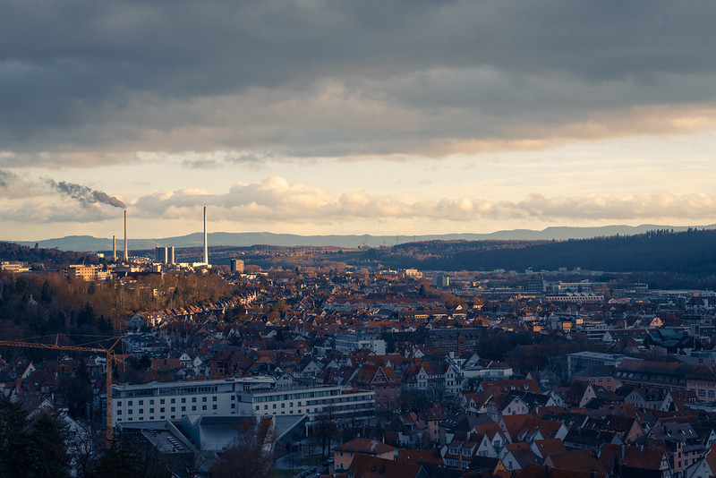

### ইতিবৃত্ত

২০১৯ সালের জুলাই মাস। ডেইলি রাত ৪ টা পর্যন্ত জাগি, দুপুর ১২ টা ১ টায় ঘুম থেকে উঠি। আম্মা সকালে চেঁচামেচি করে উঠিয়ে দিলে আরেক রুমে গিয়ে ঘুম দেই। ওখান থেকে উঠিয়ে দিলে সোফা, আবার রুম এভাবে সাইকেল চলতে থাকে । গ্র্যাজুয়েশনের পর থেকে এইটা বলতে গেলে আমার দৈনন্দিন রুটিন ছিলো। কয়দিন সকালের নাস্তা খেয়েছি মনে নাই। ব্রেকফাস্টের বদলে ব্রাঞ্চ ই করা লাগতো সবসময়। আম্মার ডেইলি এক প্রশ্ন, "এই রাইত বিরাতে কি করস তুই? পড়ালেখা করলেও তো কইতাম"। আমি গায়ে মাখাই না। আসলে সিরিয়াস কিছুই করতাম না। কোন কিছু নাই জেনেও ফ্রিজ খোলার মতন বারবার ফেবুতে ঢুকতাম বের হইতাম নাহলে কোন হাবিজাবি টিউটোরিয়াল আর প্রোডাক্ট রিভিউ দেখে বেড়াতাম। চাকরিতে জয়েন করেছিলাম, বেশিদিন করিনি। গেম খেলার মার্কামারা শখ ছিলো, গ্র্যাজুয়েশনের পরপর শখটা মরে গেছে। মাসে মাসে বস্তা বস্তা গেম কিনি। কিন্তু খেলা হয় না। খেলতে ইচ্ছা করে না । লোকে দেখলে বলবে ডিপ্রেশনে আছি। আসলেও ছিলাম হয়তো। কে জানে!

যাই হোক। এইসময় অন্যদের বাসায় যখন চাকরি বিয়েশাদি বিবিধ বিষয়ে গোলটেবিল বৈঠক চলে, তখন আমার বাসায় একটাই গ্রামোফোনের রেকর্ড বাজতো। না, কেউ বিসিএস দিতে বলে নাই। বললেও দিতাম না। রেকর্ড টা ছিলো -

> GRE কবে দিবি বাপ?

আমার এই পরীক্ষা দিতে সমস্যা ছিলো না। কিন্তু ট্রাম্প কাগুর দেশে যেতে ব্যাপক আপত্তি ছিলো। ইনফ্যাক্ট পুরো উত্তর আমেরিকা মহাদেশে যেতেই আপত্তি ছিলো। কানাডাতে চেষ্টা করেছি। মেইল দেই কেউ উত্তর দেয় না দিলেও "আচ্ছা এপ্লাই করো এই সেই" ধরণের উত্তর। নরওয়ে থেকে অফার লেটার এসে পড়ে আছে । যাবো নাকি যাবো না ঠাওর করতে পারছি না। (গ্র্যাজুয়েশনের পড় এপ্লাই করেইছিলাম একটা জায়গায়)। একটা সময় জার্মানি যাওয়ার বেশ খায়েশ জেগেছিলো। অনেকগুলো ইউনিভার্সিটি বুকমার্ক করে রেখেছিলাম। কি মনে করে যেন হুট করে সেগুলো দেখা শুরু করলাম। তখন জুলাইয়ের প্রথম সপ্তাহ। উইন্টার সেমিস্টারের অ্যাপ্লিকেশন করলে তখনই করা লাগবে, বেশিদিন বাকি নেই । সবার ডেডলাইন বলতে গেলে ১৫ তারিখ ২০ তারিখ এমন। একরকম ধরেই নিলাম যে এইবার থাক, সামারের জন্য করবো নে। কিন্তু ডেটের চাইতে বড় সমস্যা হচ্ছে, পড়বো কি নিয়ে? কম্পিউটার ভিশনে ইন্টারেস্ট ছিলো কিন্তু ফিল্ড স্যাচুরেটেড। এনএলপি দেখবো? এ বিষয়ে আমার ধারণা খুবই কম। তাও স্টুটগার্টে কম্পিউটেশনাল লিঙ্গুইস্টিক্স এর জন্য এপ্লাই করলাম । হবে না ধরে নিয়ে একেবারে খুব হেলাফেলা করে এপ্লাই করলাম। মোটিভেশন লেটার লিখলাম ৩০ মিনিটে , সব সাবমিট করলাম ১৫ তারিখ ডেডলাইন ১৩ তারিখে এমন।

কাউকে বলিনি যে এপ্লাই করেছি। এক সিনিয়র ভাই বলেছিলেন যে নিজের প্ল্যানের কথা কাউকে না বলতে। আমরা খুব জাজমেন্টাল জাতি কিনা!

### এরা নিশ্চিত পাগল

জুলাইয়ের ২৭ তারিখ। ফ্যামিলি ট্রিপে শ্রীমঙ্গল এসেছি। সকাল বেলায়, ব্রেকফাস্ট শেষে হোটেলের লবিতে দাঁড়িয়েছি, এমন সময় ভাবলাম মেইলটা চেক করি। স্টুটগার্ট থেকে মেইল দিয়েছে। মেইলের সারমর্ম হচ্ছে, "এই মিয়া পড়বা আমগো এয়ানে? আইয়া পড়ো"। আমি তো মেইল দেখে টাসকি! আমি অফার লেটার পাইসি? আসলেই? দ্রুত রুমে গেলাম, গিয়ে বাবা মাকে জানালাম।

### আসল কাহিনী তো দেখিই নাই সুমন ভাই!

ব্লক অ্যাকাউন্ট খুললাম, টাকা ট্রান্সফার করলাম। ট্রাভেল ইনস্যুরেন্স করালাম অক্টোবরের ১৪ তারিখে ক্লাস শুরু ঐ কথা মাথায় রেখে। অফার লেটার আছে, ব্লক অ্যাকাউন্ট আছে, কাগজপত্র সব রেডি (সার্টিফিকেট ট্রান্সক্রিপ্ট এগুলো)। ব্লক অ্যাকাউন্ট করেছিলাম ফিনতিবায়, ওরা স্টুডেন্ট ইনস্যুরেন্স এবং ভিসার জন্য যা যা লাগবে পাঠিয়ে দিয়েছে। কিন্তু, ভিসা ইন্টার্ভিউ এর এপয়েন্টমেন্ট ই তো পাই না! নাই মানে নাই। পুরো আগস্ট মাসে ডেইলি একটু পরপর চেক করেছি এপয়েন্টমেন্ট আছে কিনা। আর কোন কাজ ছিলো না। শেষমেষ এক ফ্রেন্ড বুদ্ধি দিলো,

> মামা, ওদের সব কাগজ সহ মেইল দে তো!

সত্যি বলতে এই বুদ্ধিটা কাজে দিলো। ওরা বেশ সুন্দর করেই জানালো যে বাপু তুমি ওয়েবসাইটে অপেক্ষা করলেই পাবে। আমি রিপ্লাই দিলাম ঠিক এইভাবে

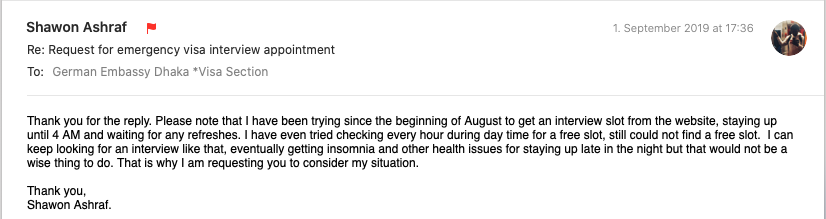

উনাদের কি বুঝে দয়া হলো জানি না, সেপ্টেম্বরের ২ তারিখে মেইল পেলাম যে বাবা, ১২ তারিখ সকাল সাড়ে ৮ টায় এসে তোমার পদধূলি দিয়ে যেও আর সব কাগজ নিয়ে এসো। কি কি কাগজ নিতে হয় তার লিস্ট অ্যাম্বেসির ওয়েবসাইটেই আছে। আমি সবে ঘুম থেকে উঠেছি। মেইল দেখে একটা লাফ দিলাম। মাটিতে নামলাম এরপর বাসায় জানালাম।

### ভিসা ইন্টার্ভিউ

অ্যাম্বেসিতে অ্যাপ্লিকেন্ট ছাড়া আর কারো ঢোকার এখতিয়ার নেই। অভিভাবক নিয়ে গেলে বিপদ। তাদের দাঁড়িয়ে থাকা লাগবে। বসার জায়গা নেই। ডিপ্লোম্যাটিক জোন, গাড়ি রাখাও ঝামেলা । আমার অ্যাম্বেসি থেকে ইন্টার্ভিউ শেষ করে বের হতে আড়াই ঘণ্টা লেগেছিলো। এই পুরো সময় বাবা বাইরে দাঁড়িয়ে ছিলো। আমি কোনদিন এই লোককে এত চিন্তিত দেখি নাই। ভিসা দিলে দিবে না দিলে নাই! এইটা নিয়ে চিন্তার তো কিছু নাই!

অ্যাম্বেসির ওয়েবসাইটে কি কি ডকুমেন্ট নিতে হবে লিস্ট দেয়া থাকলেও কি সিরিয়ালে সেগুলো সাজাতে হবে সেটা বলা নাই। সিরিয়ালের ইন্সট্রাকশন ওরা দেয় ভিতরে যাওয়ার পরে । স্ট্যাপলার না নিলেও সমস্যা নাই ওরা দিবে কিন্তু জেমস ক্লিপ না নিলে বিপদ হয়ে যাবে। এক কপি ছবি পাসপোর্টে জেমস ক্লিপ দিয়ে লাগাতে হয়। আর ডিক্লারেশন ফর্ম আছে একটা । ঝামেলা এড়াতে নিজে নিয়ে যাওয়াই ভালো। ওটা ছাড়া অ্যাপ্লিকেশন নিবে না ওরা। ওটায় লেখা থাকে যে অ্যাপ্লিকেন্ট তার ইনফরমেশন সিকিউরিটি পারপাজে ইউস করার অনুমতি দিচ্ছে । মানুষের প্রাইভেট ইনফরমেশন ইউরোপে বেশ গুরুত্বের সাথে হ্যান্ডেল করা হয়। গুগল ফেসবুক পর্যন্ত জরিমানা থেকে বাদ যায় না। যাই হোক, স্টুডেন্টদের ইন্টার্ভিউ এর জন্য একটা আলাদা কাউন্টার আছে। ওখানে আলাদা করে নাম ডাকবে । আগেই সবার পাসপোর্ট আর অন্যান্য ডকুমেন্ট নিয়ে যায়। কাউন্টারে গিয়ে ফিঙ্গারপ্রিন্ট দেয়া লাগে। দেয়া শেষ হলে প্রশ্ন শুরু -

- কোন ইউনিভার্সিটি ?
- এই প্রোগ্রামেই কেন যাচ্ছো?
- জার্মানি কেন?
- তোমার খরচ কে দিবে?
- স্টাইপেন্ড পেয়েছো?
- কই থাকবা ওখানে? (ডর্মের অ্যাপ্লিকেশন দিয়েছিলাম। থাকার জায়গার ব্যাপারে পরে বলছি)
- মাস্টার্স শেষে কি করবা?

শেষ প্রশ্নটার উত্তরে বলেছিলাম, জানিনা, আগে মাস্টার্স শেষ করি, এরপর ভেবে দেখবো নে। ওয়ান থিং অ্যাট এ টাইম।

ভিসা পেয়েছিলাম অক্টোবরের ৮ তারিখে। ৫ দিন পার হলেই ক্লাস শুরু। কিয়েক্টাবস্থা!

### শপিং

স্টুটগার্ট ইউরোপের অন্য জায়গার মতন এত ঠাণ্ডা না। এই শীতে বরফ পড়েইনি বলতে গেলে। (এটা নিয়ে এখানের লোকজনের বিরক্তির সীমা নেই)। আমি সর্বনিম্ন তাপমাত্রা পেয়েছি -৭ ডিগ্রী সেলসিয়াস। জ্যাকেট কিনেছিলাম, কয়েকটা টি শার্ট আর জিন্স। ল্যাপটপ বদলানোর দরকার ছিলো না। ফোন দেশেরগুলোই এখানে চলে (৪জি ফোন লাগবে)।

তোয়ালে, সাবান, শ্যাম্পু এগুলোর ব্যাপারে বলা লাগবে না আশা করি 😅

**ল্যাপটপের ব্যাপারে একটা স্পেশাল নোটঃ** ইউনিভার্সিটিগুলো উইন্ডোজ বলতে গেলে চালায় ই না। আপনার যদি এই এলাকায় আসার ইচ্ছা থাকে, কোন একটা লিনাক্স ডিস্ট্রো চালানো শিখে নেন এবং আসার সময় ল্যাপটপে করে নিয়ে আইসেন। সিনেমা দেখার শখ থাকলে এবং নেটফ্লিক্স অ্যাকাউন্ট না থাকলে একটা হার্ড ড্রাইভে করে নিয়ে আইসেন। এখানে টরেন্ট ডাউনলোড দিয়েছেন মানে ১৫০০€ ইউরো জরিমানা + অফেন্স হিসেবে পাসপোর্টের এগেন্সটে রেকর্ড করে নিবে । সফটওয়্যারের পাইরেট কপি চালালে সেগুলোও নিয়ে আসবেন (লিনাক্স চালালে তেমন জরুরি না)।
আপনার যদি ম্যাকবুক থাকে তাহলে কিছু করা লাগবে না। বেসিক্যালি একটা ইউনিক্স বেজড সিস্টেম থাকলেই হবে। যদি নতুন ল্যাপটপ কেনার ধান্দায় থাকেন প্রসেসিং পাওয়ারের চাইতে ব্যাটারির দিকে বেশি নজর দিবেন, আর পোর্টেবিলিটি। মানুষ সমান ওজনের এলিয়েনওয়্যার নিয়ে ঘুরতে পারবেন না। বেশি প্রসেসিং পাওয়ার লাগলে ইউনিভার্সিটির ওয়ার্কস্টেশনে SSH এ কাজ করবেন।

**সকেটঃ** জার্মানরা সবখানে ২ পিনের সকেট ইউস করে। আপনার ডিভাইসের চার্জার যদি ৩ পিনের হয় তাহলে ২ পিনের কনভার্টার নিয়ে আসবেন। নাইলে কিন্তু ধরা খাবেন! এমনিতে পুরো ইউরোপেই ২ পিন সকেট চলে । ব্যতিক্রম সুইজারল্যান্ড । এদের সকেট সিস্টেম আলাদা।

চানাচুর এনেছিলাম কয়েক প্যাকেট। কয়েকদিনেই খাওয়া শেষ। শুরুর দিকের জন্য শুকনা খাবার নিয়ে আসবেন। কেন? একটু পরেই টের পাবেন কেন। বলছি।

বইয়ের পিডিএফ আনতে পারেন তবে ভুলেও পাইরেট কপি নামাতে যাবেন না। দরকার পড়লে দেশ থেকে কাউকে বলবেন ডাউনলোড করে গুগল ড্রাইভ বা কোন ক্লাউড স্টোরেজে আপলোড করে দিতে। ইউনিভার্সিটির লাইব্রেরীতে অবশ্য এমনিতেই সব পাবেন। বই আনা জরুরি না। বাংলা বই পড়লে বেশি করে নিয়ে আসবেন। এই এলাকায় বাংলা বই পাবেন না। ইংরেজি বই অ্যামাজনে সবই পাওয়া যায়। অনেক সময় ফ্লি মার্কেটেও পাওয়া যায়।

মশলা চাল ডাল এখানে টার্কিশ বা এশিয়ান শপে গেলেই পাবেন। ওগুলো এনে ব্যাগ ভর্তি করতে যাবেন না।

### ফ্লাইট

টাকা পয়সা সামান্য বেশি লাগলেও টার্কিশে কিংবা কাতার এয়ারওয়েজে আসবেন। বাকিরা বাংলাদেশী দেখলেই কেন জানি দূর্ব্যবহার করে। সস্তার তিন অবস্থা হয় এইটা মাথায় রাখবেন। এমনিতে জার্মানিতে আসার কমন রুট হচ্ছে ঢাকা-ইস্তানবুল-জার্মানি কিংবা ইস্তানবুলের বদলে দোহা যাওয়া। আমি টার্কিশ এয়ারলাইন্সে ইস্তানবুল হয়ে এসেছি। এদের সার্ভিস ভালো। লাগেজ এলাউয়েন্স সামান্য কম কিন্তু এমনিতে এরা বেশ আন্তরিক।

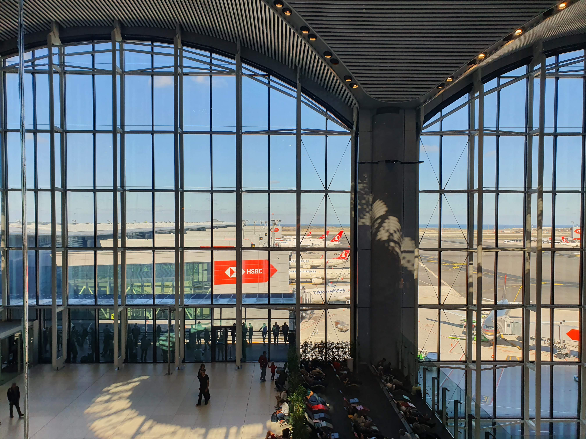

### লাগেজ

এয়ারলাইন্সের ওয়েবসাইট ঘেঁটে আপনার এলাউয়েন্স চেক করে নিয়েন। আবার পারলে নিজের ১৪ গুষ্টিকে ব্যাগে করে নিয়ে যাইয়েন না! আর এয়ারপোর্টে হ্যান্ড লাগেজ সাবধানে রাখবেন। দুনিয়াতে কত রকমের মানুষ ই আছে, নিয়ে গেলে টের ও পাবেন না এত মানুষের ভিড়ে।

### নামলাম স্টুটগার্টে

এলাম তো বটে কিন্তু না বাসা পেয়েছি না ডর্ম। বাসা নিতে গেলে এখানে স্বশরীরে এসে কথা বলা লাগে কিংবা আপনার পরিচিত কারো যদি স্থানীয়দের সাথে খাতির থাকে তাহলে সে ম্যানেজ করে নিতে পারবে। ডর্ম তো আরেক ভেজাল, খালি নাই। মহাফ্যাসাদ। ২-৩ দিন হোটেলে থাকলাম। এদিকে ওদিকে খুঁজলাম। কোন গতি হচ্ছে না। একটু ফ্লেক্স করি। আমার কপাল অসম্ভব ভালো। এরকম পরিস্থিতিতে কীভাবে কীভাবে যেন পার পেয়ে যাই। ডর্ম একটা পেয়ে গেলাম। এসলিংগেনে। ইউনিভার্সিটি ক্যাম্পাস থেকে প্রায় ৩২ কিলোমিটার দূরে। ট্রেনে যেতে লাগে ২০ মিনিট। ক্যাম্পাস থেকেই সরাসরি ট্রেইন আছে । কোনরকম সাড়াশব্দ না করে উঠে গেলাম। জার্মানিতে ডর্ম পাওয়া খুবই কঠিন ব্যাপার। পরিচিত যারা এসেছে এরা নাকি এক সেমিস্টারে ডেফার করেছে শুধু ডর্ম পায়নি বলে। ডর্ম পেয়ে তবেই এসেছে। আমি অপেক্ষা করলে পারতাম কিন্তু চোর পালালে আর বুদ্ধির কথা বলে লাভ কি?


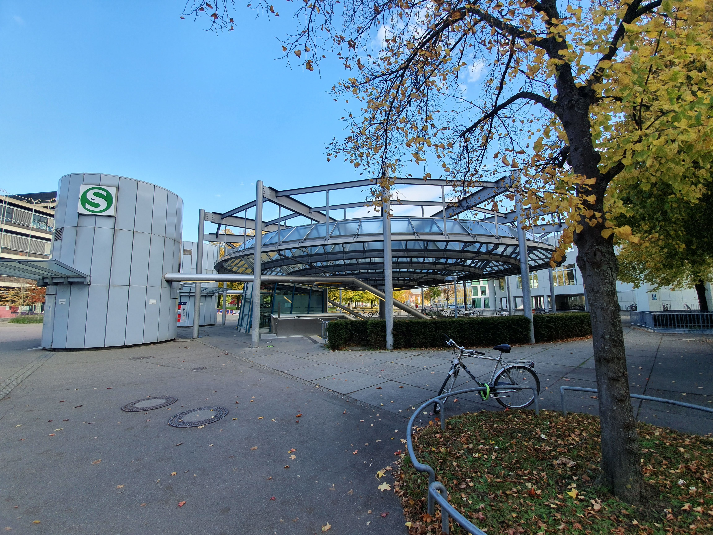

### ক্যাম্পাস, ওরিয়েন্টেশন, এনরোলমেন্ট


আমার ডিপার্টমেন্ট ভাইহিনেন ক্যাম্পাসে। এনরোলমেন্টের কাজ ও ওখানেই করতে হবে । ক্লাস ও সব ওখানেই । ইউনিভার্সিটির আরেকটা ক্যাম্পাস আছে সিটি সেন্টারে (Stadtmitte)। প্রথম দিনে গিয়ে ওরিয়েন্টেশন ধরলাম, আইটি ডিপার্টমেন্টের ফর্মালিটি শেষ করলাম। ওয়ার্কস্টেশন আর অফিশিয়াল স্টুডেন্ট মেইল আইডির জন্য সাইন আপ করতে হয়। এনরোলমেন্ট শেষ করলাম। পরদিন আইডি কার্ড দিলো। একাডেমিক ক্যাচাল শেষ।

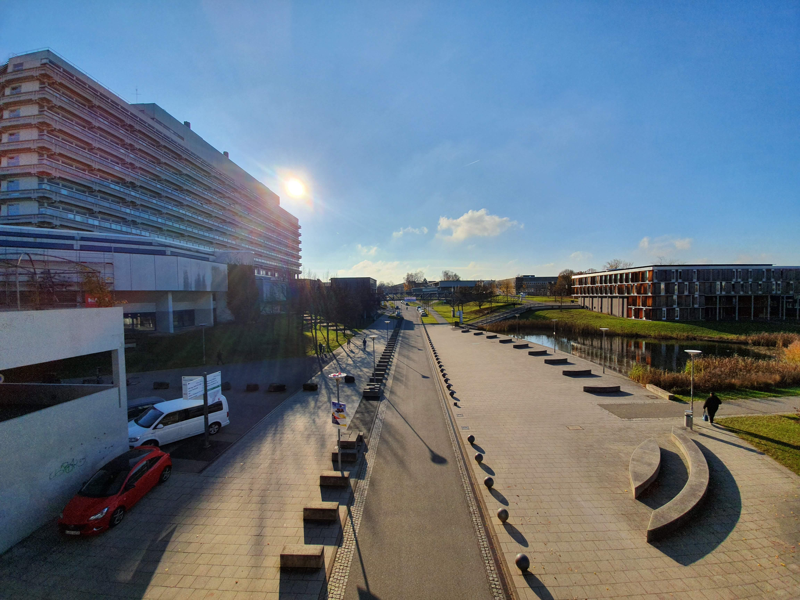

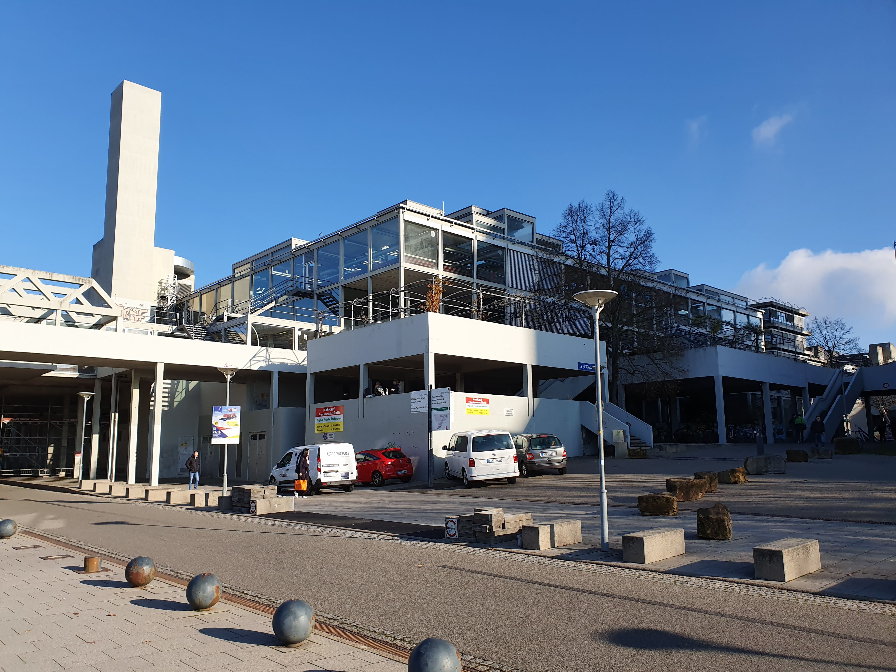

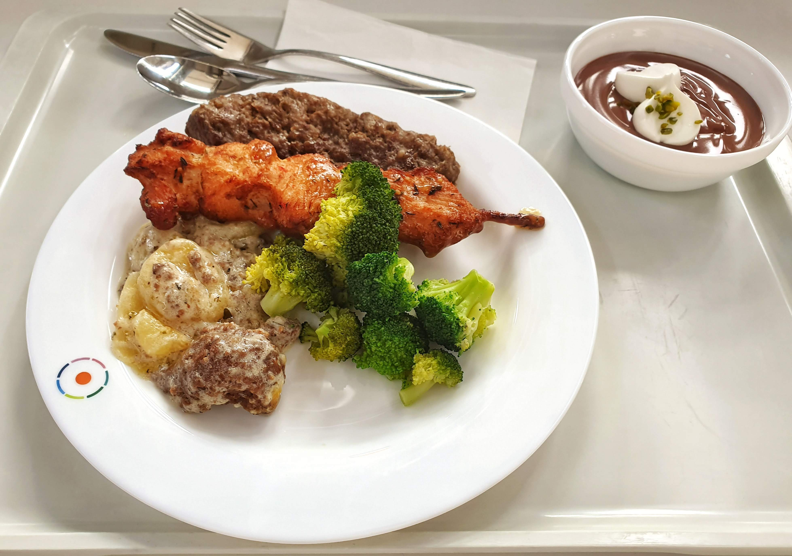

### ডর্মে তো উঠলাম, কিন্তু ...

ডর্মে ইন্টারনেট লাইন থাকে কিন্তু শুধু ক্যাবল বেজড। ওয়ালে আউটলেটে নিজের ক্যাবল দিয়ে কানেক্ট করলেই চলে । সবার আগে রাউটার কিনলাম। ওয়াইফাই নেটওয়ার্ক সেটআপ করলাম, আম্মাকে ফোন দিয়ে বললাম যে রুমে এসেছি। রুম গুছালাম। আলমারি দেয়াই আছে। ব্যাগ খালি করে সব রাখলাম। এখন খাবারের ব্যবস্থা করা লাগবে।


বলতে ভুলে গেছি, এরা বেডশিট দেয় না । নাহলে বাকি সব দিয়ে দেয়। বেডশিট নিয়ে আসবেন।

চাল ডাল মশলাপাতি নাহয় কিনলাম, থালাবাসন কি পাবো? কিছু তো আনি নাই সাথে। (আমার মতন ভুল করবেন না, সাথে করে মেলামাইনের প্লেট মগ নিয়ে আসবেন) শুকনো খাবারের কথা বলেছিলাম না? এসব খেয়েই ছিলাম প্রথম কয়েকদিন। সুপারমার্কেটে গিয়ে কড়াই চামচ এগুলো পেলাম। প্লেট লাগবে । আর মগ। এমনিতে কাটলারি স্টোরে আস্ত সেট ছাড়া বেচে না। ঢুকলাম দেশী ১ টু ৯৯ এর জার্মান ভার্শন 1€ für Alles বা ইউরোশপে। যা পেলাম কিনে নিয়ে এসে হাজির হলাম। এখন আসল ঝামেলা হচ্ছে, আমি রান্না জানি না। কি মসিবত!

আম্মাকে হোয়াটসঅ্যাপে কল দিলাম। আম্মা রেসিপি দিলো। হলুদ কিনতে মনে নাই। হলুদ ছাড়া খিচুড়ি রান্না করলাম। দেখার মতন অবস্থা ছিলো। আমি প্রায় ১০ দিন পর পেটে ভাত জাতীয় কিছু গেসে এতেই খুশি। ঠিক এই সময়ে আমার দাদী বাসায় ছিলো। সে শুনতে পাইসে যে আমি এতদিন ভাত খাইতে পাই নাই, এইখানে নিজে রাঁধতে হয়, ব্যস সে কাইদা কাইটা অস্থির,

> হ্যাঁয় কি তগো ভাত খাইয়া লাইত ? ক্যারে এমন জায়গায় পাঠাইসস যে ভাত নাই!

--

ইলেক্ট্রনিক্স কিনলে জার্মানিতে বড় স্টোর হচ্ছে Saturn (এরা বলে জাটুর্ন), Otto, MediaMarkt এগুলো। এসলিংগেনে Saturn এর স্টোর আছে সেখান থেকে ২৫€ দিয়ে রাইস কুকার কিনেছিলাম। এখানে একটা মজার ঘটনা আছে। পরে বলছি। রাইস কুকার থাকায় রক্ষা হয়েছিলো, খিচুড়ি নামে যাই রান্না করেছিলাম, সহজে হয়ে গিয়েছিলো।

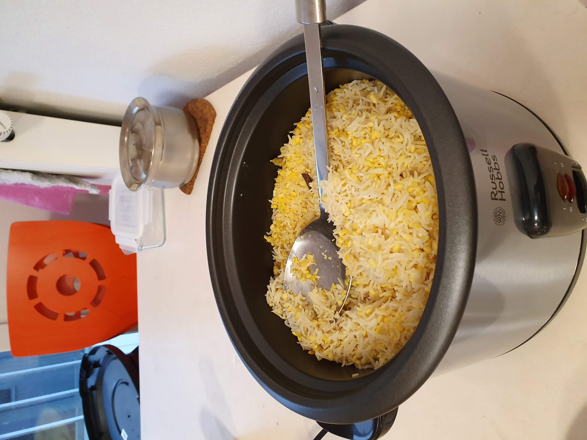

বিপদে পড়লে মানুষ সবই শিখে। আমি রান্না করা শিখেছি । এখন খুব ভালো রান্না করতে না পারলেও মোটামুটি পারি। মানে খাওয়া যায় আরকি। মরিচ একটু বেশি দেই, ঝাল বেশি হয়, নিজেই নাকের চোখের জল এক করে খাই, পরের মুহূর্তেই ভাবি এই দেশের মরিচ ঝাল না, পরের বার এমনই দিবো ।


এবার আসল কাহিনীতে আসি।

### ইয়ে মানে, বদনা বা হ্যান্ড শাওয়ার নাই?

Nein. এইসব জিনিস এই মুল্লুকে নাই। ডেস্পারেট পোলাপান বদনার বদলে বোতল ইউস করে। কেউ বদনা নিয়ে আসে দেখেছি। এখানের বাথরুমে পানি সরার ব্যবস্থা নাই। ফ্লোর ভিজালে নিজ দায়িত্বে মুছতে হবে (যদি হাউজমাস্টার বা বাড়ীওয়ালার রোষানলে পড়তে না চান, পড়লে মরবেন। একটা সিঙ্গেল ফ্লোর ক্লিন করতে যদি সে ক্লিনার কোম্পানি ডাকে তাহলে ৭০০€~১০০০€ নাই হয়ে যাবে)। ডর্মে নাহয় বোতলে কাজ সারলেন। বাইরে গেলে কি জঙ্গলে গিয়ে লতাপাতা দিয়ে কাজ সারবেন? টয়লেট টিস্যু ব্যবহারে অভ্যস্ত হন।

> Wann in Deutschland macht was der Deutsche mache - When in Germany do what the Germans do.

### ভিসা এক্সটেনশন এবং বিখ্যাত জার্মান পেপারট্রেইল

জার্মানদের মতে এই দেশ ৩ জিনিসের জন্য বিখ্যাত -

- আলু
- বিয়ার
- পেপারওয়ার্ক কিংবা মাঝে মধ্যে আমলাতান্ত্রিক জটিলতা

আপনাকে ইনিশিয়ালি ৬ মাসের ভিসা দিবে। এখানে এসে এক্সটেন্ড করতে হবে। এক্সটেন্ড করতে ইনস্যুরেন্স, ইউনিভার্সিট এনরোলমেন্ট লেটার, ব্লক অ্যাকাউন্টের ডকুমেন্ট দেখাতে হবে। ওসব সমস্যা না । আসলটা হচ্ছে আপনাকে ব্যাংকে একটা চেকিং অ্যাকাউন্ট খুলতে হবে, নতুবা ব্লকের টাকা আনব্লক হবে না, ইনস্যুরেন্স ও একটিভ হবে না। আর ব্লকের পুরো টাকাও একবারে দিবে না। মাসে মাসে ৮৫৩€ করে পাবেন। ব্যাংক অ্যাকাউন্ট খুলতেই যা ঝামেলা। আসলে ঝামেলা না, অনলাইনেই করা যায়। আমি জানতাম না। অযথা সময় নষ্ট করেছি। এখন কথা হচ্ছে কোন ব্যাংকে অ্যাকাউন্ট খোলা যায়?

- আপনার যদি ইউরোপের এদিক ওদিক ঘোরাফেরার ইচ্ছা থাকে এবং সেসময় ব্যাংক কার্ড ইউস করতে চান তাহলে CommerzBank, Sparkasse, Deutsche Bank. ডয়েশে ব্যাংকের সার্ভিস ভালো না । বাকি দুইটার মেইনটেনেন্স চার্জ বেশি কিন্তু সার্ভিস ভালো। স্পারকাসের ব্যাংকিং অ্যাপে আবার ইংরেজি নাই । বুঝে শুনে নিয়েন । ডয়েশে ব্যাংকের লোকজন যদি শুরুতে আমাকে বলতো যে অ্যাকাউন্ট অনলাইনে খোলা যায় আমি তাই করতাম। এরা আমার ২ সপ্তাহ বরবাদ করেছে এইসব করে।
- রিজিওনাল ব্যাংক গুলোও ভালো । যেমন এই এলাকায় BW-Bank (BW = Baden-Württemberg) আছে। এছাড়া Postbank ও খারাপ না।

ব্যাংক অ্যাকাউন্ট খোলার জন্য একটা পেপার লাগবে । সেটা হচ্ছে সিটি রেজিস্ট্রেশন সার্টিফিকেট। আপনি যে এই শহরে ঠিকানা পেয়েছেন সেটার প্রমাণপত্র। ডর্ম থেকে কন্ট্রাক্ট পেপার দিয়ে দিবে, হাউজমাস্টার সাইন করে দিবে । বাসা নিলে আপনার বাড়ীওয়ালা দিবে। সেটা নিয়ে সিটি অফিস (Rathaus বা Ausländer Bürgeramt) এ যাবেন, ওরা পাসপোর্ট কপি করে সিল দিয়ে সার্টিফিকেট দিয়ে দিবে। এটাকে ওরা বলে Anmeldung । **হোটেলের ঠিকানা দিয়ে Anmeldung করতে পারবেন না ।**

ব্যাংক অ্যাকাউন্ট হয়ে গেলে সিটি অফিসের এপয়েন্টমেন্টের জন্য অপেক্ষা করবেন। যেদিন যেতে বলবে গিয়ে সব কাগজ দিবেন, আপনার ভিসা এক্সটেনশনের ক্যাচাল শেষ। আপনাকে আইডি কার্ড দিবে, ওটা আসতে ২২ দিন লাগবে । ততদিন নাকে তেল দিয়ে ঘুমান। এর মাঝে মেইল চেক করবেন যে আপনার ইনস্যুরেন্স সব রেডি হয়েছে কিনা । ফিনতিবার পোর্টালে সব আছে। ভালো কথা, ফিনতিবায় অনেকেই ব্লক অ্যাকাউন্ট খুলে কিন্তু ইনস্যুরেন্স নেয় না। আপনার ইচ্ছা নিবেন কিনা কিন্তু না নিলে এখানে এসে দৌড়ঝাপ করা লাগবে । আগে করে আসাই ভালো। টাকা সামান্য বেশিই গেলো নাহয়! (৩০ বছরের কম বয়স হলে সরকারি ইনস্যুরেন্স পাবেন, মাসে ৯৮€-১১০€ করে দিতে হয়)

### সিম কার্ড

এই জিনিস ছাড়া কি এই যুগে চলতে পারবেন? এখানে মেজর অপারেটর হচ্ছে Telekom DE (অন্য দেশে নাম T-Mobile), Vodafone, O2

থার্ড পার্টি অনেক সার্ভিস আছে যারা কিনা মেজর অপারেটরদের নেটওয়ার্কে লগইন করে ওদের সার্ভিস ইউস করতে দেয়, এদের ট্যারিফ সস্তা। যেমন Lebara, Blau, Aldi-Talk ইত্যাদি। ভুলেও Mobilcom-Debitel এর সিম নিবেন না। সার্ভিস জঘন্য এবং টাকাও বেশি কাটে। মাসে ২-৩ গিগাবাইট ইন্টারনেট আর ফ্ল্যাট কলরেট দেয় এমন প্যাকেজ নিবেন। ট্রেনে বাসে ওয়াইফাই আছে, মোবাইল ডেটা তেমন ইউস হবে না (যদি আপনি সব মোবাইল ডেটায় চালান আপনার ইচ্ছা)।

### জার্মান জানা জরুরি?

বড় শহরে সমস্যা হয় না তবে ছোট শহরে দোকানপাটে বিপদে পড়বেন। দাম বলবে জার্মানে, সেলসপার্সন কথা বলবে জার্মানে। এরা ভালই ইংরেজি জানে কিন্তু বলতে স্বাচ্ছন্দ্যবোধ করে না। আপনিই একবার ভাবেন চায়ের টং এ গিয়ে বলছেন "Mr.Teamaker please make me a cup of tea"। 😂

সুপারশপে ডিসপ্লে দেখে আমার মতন পার পেয়ে যাবেন। অন্য জায়গায় পারবেন না। আসার আগে Duolingo দেখে অন্তত সংখ্যা, সপ্তাহের দিনগুলোর নাম শিখে আসবেন। বাকি জিনিস ভাঙাচোরা ইংরেজিতে বললে ওরা আন্দাজ করে নিবে।

রাইস কুকার নিয়ে মজার ঘটনা বলি। এই জিনিসের ওয়ারেন্টি আছে। ওয়ারেন্টি নিতে চাইলে ৩€ বাড়তি দেয়া লাগে। ব্যাটা বলে জার্মানে, আমি তো আর বুঝি না, ব্যাটায় ১০ মিনিট পর বুঝতে পারসে যে আমি শালা নয়া মাল, ডয়েশ পারি না। তখন আরেকজনকে ডেকে আনসে। সে বলতেসে You want the guarantee?

আমি বললাম Nope. শালা এতক্ষণে?(মনে মনে)

এখন শিক্ষিত হয়ে গেসি। দোকানপাটের ভাষা অন্তত বুঝি।

### জিনিসপত্রের দাম কেমন?

একেক স্টেটে একেকরকম। কই থেকে কিনবেন তার ওপর ও নির্ভর করে। Rewe, Edeka এরা একটু এক্সপেনসিভ। D&M, Lidle, Aldi এসব জায়গায় দাম কম। কয়েকদিন থাকলেই দাম টের পেয়ে যাবেন । আমি সবসময় Rewe থেকে কিনি। দামের জন্য না। আমি অলস মানুষ, Rewe কাছেই আছে তাই ওখানেই যাই।

### ডোনার কেবাপ, বিয়ার, ওয়াইন

জার্মানিতে এসে ডোনার কাবাব বা কেবাপ না খাওয়া আর ঢাকায় থেকে কোনদিন কাচ্চি না খাওয়া সমান কথা। টার্কিশরা এই একটা জিনিস অসম্ভব ভালো বানায়। বিশেষ করে আমাদের মতন মশলাখোর জাতির জন্য পার্ফেক্ট। জার্মান খাবারে খুবই কম মশলা থাকে।

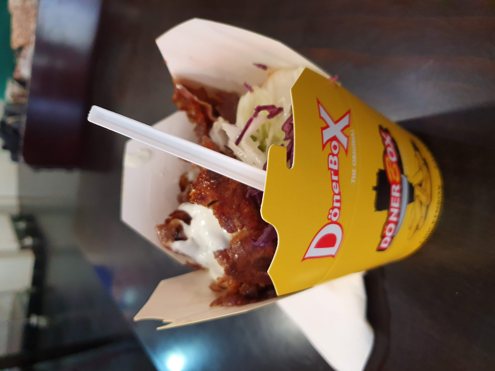

জার্মান বিয়ার আর ওয়াইন বিখ্যাত। আপনি অ্যালকোহল খাবেন নাকি খাবেন না আপনার ব্যাপার। এমনো জার্মান আছে অ্যালকোহল খায়না আবার এমনো বিদেশি আছে যাদের উইকেন্ডে বোতল ছাড়া দেখা যায় না। পার্সোনাল পার্স্পেক্টিভের ব্যাপার। চাইলে খাবেন নাইলে না। কেউ জোর করছে না।

এমনিতে জার্মান খাবার যদি খেতে চান শ্নিটজেল অবশ্যই খেয়ে দেখবেন। আপনার যদি হালাল হারাম নিয়ে মাথাব্যাথা থাকে তাহলে কি করবেন আমার জানা নেই। আমি এ বিষয়ে এত মাথা ঘামাই না। খাবার খাবারই। হ্যাঁ এখন আপনি যদি পর্ক এড়াতে চান তাহলে চিটশিট দিয়ে দেই

| জার্মান নাম     | বাংলা নাম   |
| :-------------- | :---------- |
| Hähnchenfleisch | মুরগীর মাংস |
| Rindfleisch     | গরুর মাংস   |
| Schweinefleisch | পর্ক        |

### ট্রেন বাস সার্ভিস

একেক শহরে একেক রকম। সেমিস্টার টিকেট কিনে নিবেন। আনলিমিটেড পাস দিবে। সেটা দিয়ে যখন খুশি যতবার খুশি আসা যাওয়া করতে পারবেন। টিকেট ছাড়া উঠলে এবং ধরা খেলে ৬০€ জরিমান প্লাস ক্রিমিনাল অফেন্স রেকর্ড হবে।

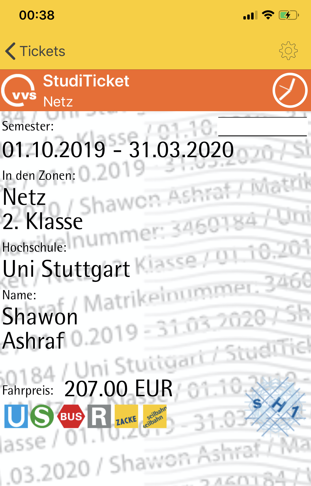

### ওয়েস্ট ম্যানেজমেন্ট

দেশে তো এক ডাস্টবিনে সব ফালান। এখানে প্লাস্টিকের বিনে কাগজ ফেলে কিংবা উল্টোটা করে দেইখেন। পরদিন সকালে ১৫০€ ফাইন ধরায়া দিবে। আশেপাশের লোকদের জিজ্ঞেস করে নিবেন কোনটা কি।

### চিঠি আইসে!!!!!!!!!!!

ওয়েল এই যুগেও জার্মানরা চিঠি পাঠায়। ব্যাংকের কার্ড হোক আর পাসপোর্ট সব এরা পোস্টেই পাঠাবে। রেগুলার মেইলবক্স চেক না করলে অনেক কিছু মিস করবেন। আমি যেমন ব্যাংক কার্ড এসে পড়ে থাকার ৫ দিন পরে টের পেয়েছি :3

### Esslingen

ফর্মাল কথাবার্তা অনেক বললাম। যে এলাকায় থাকি তার ব্যাপারে কিছুই বলি নাই। এসলিঙ্গেন বেশ পুরাতন শহর। রোমানরা যখন এই এলাকায় আসে তখন এই টাউন বানিয়েছিলো । ৭৭৪ সালে। সুন্দর ছিমছাম জায়গা। দালানকোঠা বেশিরভাগই দেড় দুইশো বছর পুরনো।

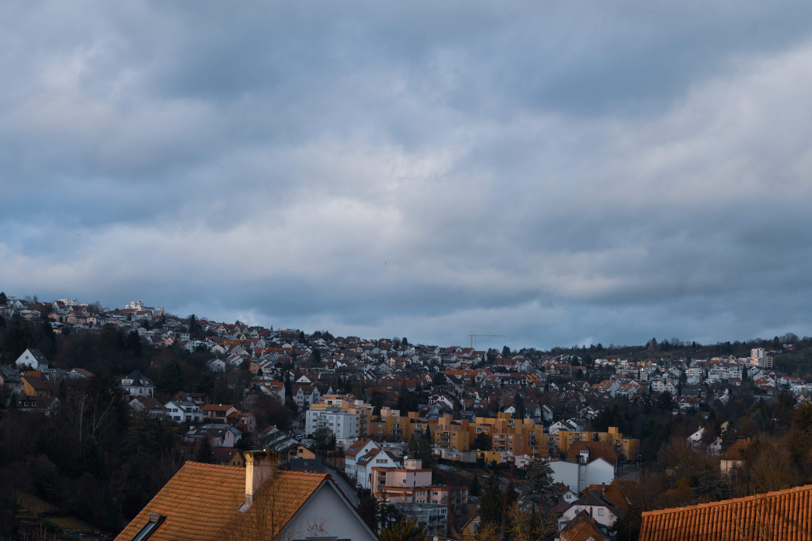


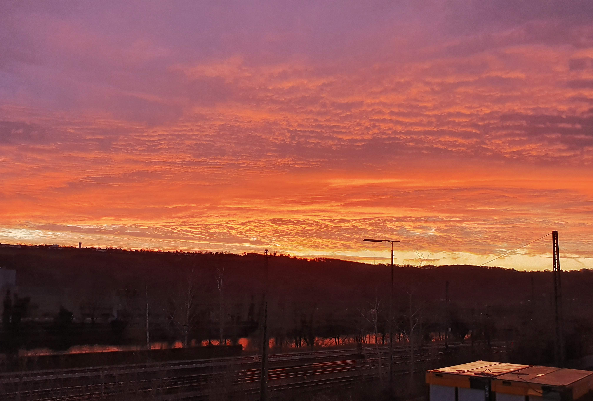

এভাবে ছবি দিতে থাকলে এইখানে একটা অ্যালবাম বানিয়ে ফেলা যাবে। আমি ফ্লিকারে একটা অ্যালবাম বানিয়ে রেখেছি। এই এলাকায় যা ছবি তুলি সব ওখানে আপলোড করে দেই।

<a href="https://flic.kr/s/aHsmKc4Ksw">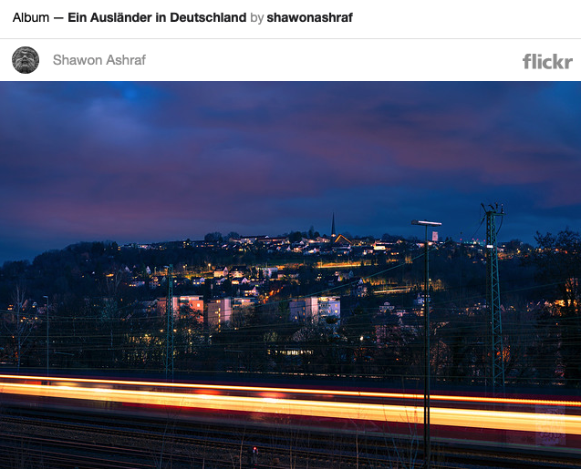</a>

### প্রায় ৮ হাজার মেইল দূরে......

দেশ থেকে অনেক দূরে আছি। দেশে যেতে ইচ্ছা করে। সেমিস্টার শেষ না হলে তো আর যেতে পারবো না, অপেক্ষায় আছি কবে দেশে যাবো। অনেকদিন কাচ্চি খাই না। বসুন্ধরা মেইনরোডের ফুচকা মিস করি। আম্মার রান্না করা গরুর মাংস ভুনা খাই না ম্যালাদিন। ছোট ভাইটাকে অনেকদিন দেখি না। ভিডিও কল দিয়ে দেখা আর সামনে দেখা এক না। ছেলেটা বুঝে আমি বাসায় নাই, অনেক দূরে।

সেমিস্টার শেষ হোক। বাসায় গিয়ে সোজা সটান হয়ে নিজের বিছানায় ঘুম দিবো। এইখানের লেতলেতা বালিশে ঘুম আসে না।

--

রুম পাওয়ার আগের কথা, ক্যাম্পাসে আদনান ভাইয়ের সাথে দেখা। উনি ভাত রান্না করে খাইয়েছিলেন।

- কি মিয়া খাও না কেন?
- মনে শান্তি পাই না। মনে শান্তি না পাইলে ভাত কেন কোন কিছুই গলা দিয়ে নামেনা ।
- (হাসতে হাসতে) এতদূর আসতে পারসো আর এই হার্ডল পার করতে পারবা না? চিন্তা কইরো না।

এই ভুখারে খাওাইসেন, সাহস দিসেন, আমি এন্টার্কটিকা গেলেও মনে রাখবো সেইটা। আপনাকে অনেক ধন্যবাদ আদনান ভাই।

আরেকজনের কথা না বললেই না। এনাকে সময়ে অসময়ে ম্যালা জ্বালাতন করসি। তাহমিদ ভাই। জিওস্ট্যাটের মতন জিনিস পড়েও উনার রসিকভাব যায় নাই।

--

মাঝে মাঝে ভাবি এতদূর থাকি, কেন থাকি, পরে থাকতাম নাহয় দেশে। আমার নিজের সাধ অভিলাষ খুব কম, একগাদা বই আর গেম পেলে আমার দিন অনায়াসে কেটে যাবে। আমার বাবার খুব ইচ্ছা ছিলো ছেলে PhD করবে একদিন। আমি এই ইচ্ছার জন্য আছি। যেদিন ইচ্ছাটা পূরণ হবে সেদিন মানুষ হিসেবে আমার আধা দায়িত্ব শেষ।

--

যান মিয়ারা, বেশি লেইখা ফালাইসি। আর লিখতে গেলে এতদিন কষ্ট করে যে ইমোশনলেস ড্রাই হিউমারওয়ালা জার্মান ক্যারেক্টারিস্টিক রপ্ত করসি সব ভুলে গিয়ে সেন্টু বাঙালি হয়ে যাবো।

যারাই ভবিষ্যতে দেশ থেকে দূরে পড়তে যাবেন, জার্মানি যান আর যেখানেই, একটা মহৎ উদ্দেশ্য নিয়ে যাবেন যে পড়বেন, ভালো করবেন, এরপর যা শিখেছেন সেটা দিয়ে মানুষের জন্য কিছু করার চেষ্টা করবেন। টাকা পয়সা অবশ্যই কামাবেন, মানুষ তো আর চাঁদের আলো খেয়ে বাঁচতে পারে না তাই না! টাকা কামাতে গিয়ে মানুষ হিসেবে নিজের করণীয় ভুলে যাবেন না। যদি স্টুটগার্টে আসেন আওয়াজ দিয়েন।

Beste Glück und Willkommen bei Deutschland.

--

```bash
  Wohnheim Rossneckar
  Esslingen, Baden-Württemberg,
  Deutschland.
  Sonntag, 02 Februar, 2020.
```
