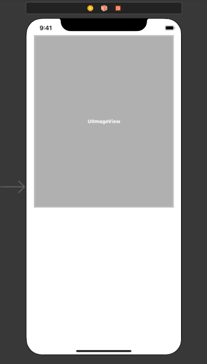

### Images and URLs

You're writing the front-end of a fancy website. You have to load images from a remote server and you have the url. What do you do? You take sip from your cup of coffee, grin and pull some HTML trickery. Just like this -

```html

```

And that's it, the day (or, night) is saved, thanks to, the PowerPuff Girls! Oh wait, your image tag!

### How's that for a mobile app dev?

App devs are an unlucky folk. They don't get to enjoy the niceties web developers have. It's a very melancholic way to put it, but their life isn't as straightforward as loading an image with an HTML tag.

### Okay let's get back on topic

Let's say you want to have the same life of a front-end web dev, meaning you want to load images from remote servers in your image views without sacrificing a virgin (that's how it is actually), how do you do it?

### Preparing

Create a Single View iOS project. Add an `ImageView` to your `View` and create an outlet for it (if you're a beginner, ctrl + click and drag it to create a variable). Add constraints if you feel necessary, though not mandatory for our discussion.



### The hard way - URLSessionDataTask

For this, you need to init an URLSession, then create and start a `datatask`, add in an `async` handler for data task completion and then set the image. Oh wait! You can't use the `main thread` to set the image. You should fire up a separate thread via `dispatchqueue` to do so.

```swift
func fetchImage(from urlString: String, completionHandler: @escaping (_ data: Data?) -> ()) {
		let session = URLSession.shared
    let url = URL(string: image_url)

    let dataTask = session.dataTask(with: url!) { (data, response, error) in
        if error != nil {
            print("Error fetching the image! 😢")
            completionHandler(nil)
        } else {
            completionHandler(data)
        }
    }

    dataTask.resume()
}
```

And to set the image on an `ImageView` (finally!) -

```swift
@IBOutlet weak var imageView: UIImageView!

func setImageToImageView() {
    fetchImage { (imageData) in
        if let data = imageData {
            // referenced imageView from main thread
            // as iOS SDK warns not to use images from
            // a background thread
            DispatchQueue.main.async {
                self.imageView.image = UIImage(data: data)
            }
        } else {
		        // show as an alert if you want to
            print("Error loading image");
        }
    }
}
```

All this, just to load an image eh?

### The easy way

Yes, there's an easy way. What we've been doing all alone is that we're fetching resources from the network (images or whatever) as `Data` objects and then converting them according to our needs, be it an `image` or a large dump of `json`. `Data` has one `initializer` where you can create an object of it from the contents of an `URL`. This can make things a bit easier. Let's check it out.

```swift
func setImage(from url: String) {
    guard let imageURL = URL(string: url) else { return }

		// just not to cause a deadlock in UI!
    DispatchQueue.global().async {
        guard let imageData = try? Data(contentsOf: imageURL) else { return }

        let image = UIImage(data: imageData)
        DispatchQueue.main.async {
            self.imageView.image = image
        }
    }
}
```

Let's test it with an actual image url.

```swift
setImage(from: "https://image.blockbusterbd.net/00416_main_image_04072019225805.png")
```

### How does it look?


### That does it, but wait

Everything comes at a cost, so does this easy approach. There's a reason people tend to use the hard way for network requests (which are not just for images, mind you). It's that, Swift lets you observe the progress of the network operations in real time if you choose to use URLSession and its delegates. Which comes in handy for larger network requests, where you can let the user know about the progress with fancy progress views or something else. For the easy approach above however, there's no way to do so unless you bite the metal and write things like that yourself. For simple image loading, our easy approach will do more than good. However, for sophisticated tasks, you better be using the hard way.

### Time for a song

<iframe src="https://open.spotify.com/embed/track/6I5sXrfF7bXBQunfn9nH4g" width="300" height="380" frameborder="0" allowtransparency="true" allow="encrypted-media"></iframe>
