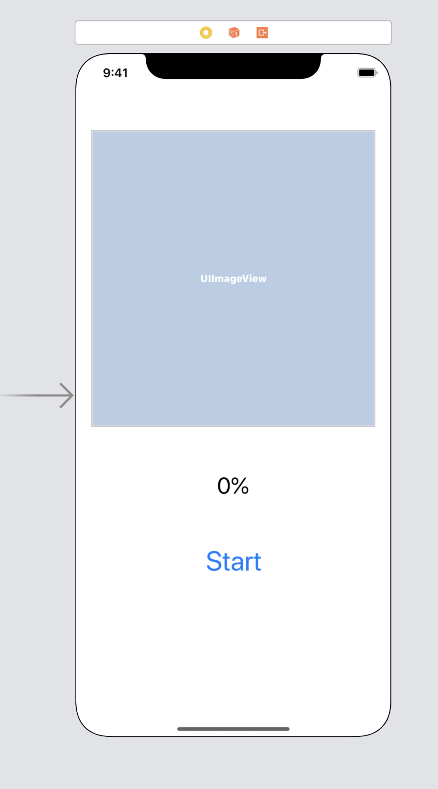

## Downloading ....

You've this cool app that has to download something from the internet, be it images, data or pdf files or whatever. While your app downloads the required resources, your user has to wait. Now this isn't an issue if the resources are small or can be fetched really fast. What if the process isn't fast enough or the resource is very large (say size in MB in double or even triple digits!)? Your users will have to stare at a blank screen with a probably unresponsive app (depending on how you handled resource loading) which is a deal breaker and may lead users away from your app. You must do something to assure the users that the required resource is indeed loading and the app isn't stuck at some deadlock. Show them some progress. Animation, text, percentage labels - whatever goes with your app. Question is, how do you track the download progress to show to your users?

## URLSessionDownloadDelegate

You can track download progress in your Swift app using `URLSessionDownloadDelegate` functions. What you have to do is -

- Create an `URLSession` with a `.default` configuration
- Using the created session, init a `downloadTask`
- Track the progress of that `downloadTask` with `URLSessionDownloadDelegate` function -

```swift
func urlSession(_ session: URLSession, downloadTask: URLSessionDownloadTask, didWriteData bytesWritten: Int64, totalBytesWritten: Int64, totalBytesExpectedToWrite: Int64)
```

- Yes you've to implement the function
- There's another function you'll have to implement, which fires up when your download task is complete -

```swift
func urlSession(_ session: URLSession, downloadTask: URLSessionDownloadTask, didFinishDownloadingTo location: URL)
```

## Let's start!

We start by creating a single view iOS application in Xcode. What this app is going to do is: download an image from a url, show the progress in a label with percentage and finally set the downloaded image to an image view (so that we can be sure that the image actually downloaded!). In the end it should look like this -


## Interface

Open up storyboard and add 3 controls - an imageview, a label and a button, using any constraints you like. (Constraints aren't necessary for our discussion at the moment) Take the image below for reference.



Create the necessary outlets and add an action for the button (ctrl + drag).

```swift
class ViewController: UIViewController, URLSessionDownloadDelegate {
    @IBOutlet weak var imageView: UIImageView!
    @IBOutlet weak var percentageLabel: UILabel!
    @IBOutlet weak var startButton: UIButton!

    override func viewDidLoad() {
        super.viewDidLoad()
    }

    // MARK: event handler
    @IBAction func startButtonTapped(_ sender: Any) {
		// code goes here
    }
}
```

We also have to set the content mode for imageview so that the downloaded image fits in properly. You can either do it from the storyboard or just with code inside `viewDidLoad` like I did.

```swift
override func viewDidLoad() {
    super.viewDidLoad()
	// fit image to the view
    imageView.contentMode = .scaleAspectFill
}
```

## Now for the main course

### Creating the downloadTask

Let's add a function named `download` to our `ViewController` class. It's going to take the `url` of the image as the only parameter.

```swift
// MARK: fetch image from url
func download(from url: URL) {
    let configuration = URLSessionConfiguration.default
    let operationQueue = OperationQueue()
    let session = URLSession(configuration: configuration, delegate: self, delegateQueue: operationQueue)

    let downloadTask = session.downloadTask(with: url)
    downloadTask.resume()
}
```

Let's check what we've done here. We've created a default config for the URLSession. Next we've created an OperationQueue so that our downloadTask can run asynchronously without locking up the app (i.e. causing a deadlock). (To know more, read on GCD in docs). This will ensure that the other parts of our app will be accessible to the users while the app downloads the image. Finally we're creating the download task using the session and asking it to resume / start operation. For image url, we're going to use this one - `https://upload.wikimedia.org/wikipedia/commons/thumb/a/aa/Polarlicht_2.jpg/1920px-Polarlicht_2.jpg?1568971082971`. \

Now we have a slight problem. Our function requires an URL but we've that as String. So, we need to convert the string to a URL.

```swift
// MARK: prepare url from string
func getURLFromString(_ str: String) -> URL? {
    return URL(string: str)
}
```

### Starting the download

We'll be calling the download function when a user taps the button.

```swift
// MARK: event handler
@IBAction func startButtonTapped(_ sender: Any) {
    let url = "https://upload.wikimedia.org/wikipedia/commons/thumb/a/aa/Polarlicht_2.jpg/1920px-Polarlicht_2.jpg?1568971082971"

    if let imageURL = getURLFromString(url) {
        download(from: imageURL)
    }
}
```

### Where's the progress at?

We do have a progressLabel, and we can update its text property every time `downloadTask` makes progress. But the question is where do we update it? We've two delegate functions to implement right? Let's implement the first one and put the label updating code in there.

For download task, URLSessionDownloadDelegate lets you track the amount of bytes to be received and the amount of bytes being received currently. Using these two metrics, we can calculate the percentage.

```swift
// MARK: protocol stub for tracking download progress
func urlSession(_ session: URLSession, downloadTask: URLSessionDownloadTask, didWriteData bytesWritten: Int64, totalBytesWritten: Int64, totalBytesExpectedToWrite: Int64) {

    let percentDownloaded = totalBytesWritten / totalBytesExpectedToWrite

    // update the percentage label
    DispatchQueue.main.async {
        self.percentageLabel.text = "\(percentDownloaded * 100)%"
    }
}
```

That'll take care of tracking download progress, what we've chasing so far. But wait, we're not done yet.

## Side Concerns - download done, how to set the image then?

By default, resources downloaded with downloadTask end up in the documents bundle of the app which can be accessed using `FileHandle`. For that, we need the `URL` to the file, where do we get that? Remember the second protocol function? That'll give us the `URL` of the file.

```swift
// MARK: protocol stub for download completion tracking
func urlSession(_ session: URLSession, downloadTask: URLSessionDownloadTask, didFinishDownloadingTo location: URL) {

    // get downloaded data from location

    // set image to imageview
}
```

### Accessing downloaded data

We'll be adding a function `readDownloadedData` which reads the downloaded resource as raw data and returns it. The function returns an optional for safety.

```swift
// MARK: read downloaded data
func readDownloadedData(of url: URL) -> Data? {
    do {
        let reader = try FileHandle(forReadingFrom: url)
        let data = reader.readDataToEndOfFile()

        return data
    } catch {
        print(error)
        return nil
    }
}
```

Now that we've the raw data, we can use that to create a `UIImage` to set to our imageview.

### UIImage from Data?

```swift
func getUIImageFromData(_ data: Data) -> UIImage? {
    return UIImage(data: data)
}
```

### Setting the image

```swift
// MARK: set image to image view
func setImageToImageView(from data: Data?) {
    guard let imageData = data else { return }
    guard let image = getUIImageFromData(imageData) else { return }

    DispatchQueue.main.async {
        self.imageView.image = image
    }
}
```

### Completing the protocol function

```swift
// MARK: protocol stub for download completion tracking
func urlSession(_ session: URLSession, downloadTask: URLSessionDownloadTask, didFinishDownloadingTo location: URL) {

    // get downloaded data from location
    let data = readDownloadedData(of: location)

    // set image to imageview
    setImageToImageView(from: data)
}
```

And we're done! When you run the app in Simulator or your Device, expect to see similar results like the gif I showed earlier.

## Aaaaand......

And that's how you track download progress in your Swift app using `URLSessionDownloadDelegate` without adding any extra dependencies to your app. You can also do the same thing with libs like Alamofire, with less code and headache but that'll add and extra dependency which you may or may not want!

## Code - Where at?

You can find all the code for this post @[URLSessionProgressTrackerExample](https://github.com/ShawonAshraf/URLSessionProgressTrackerExample)
